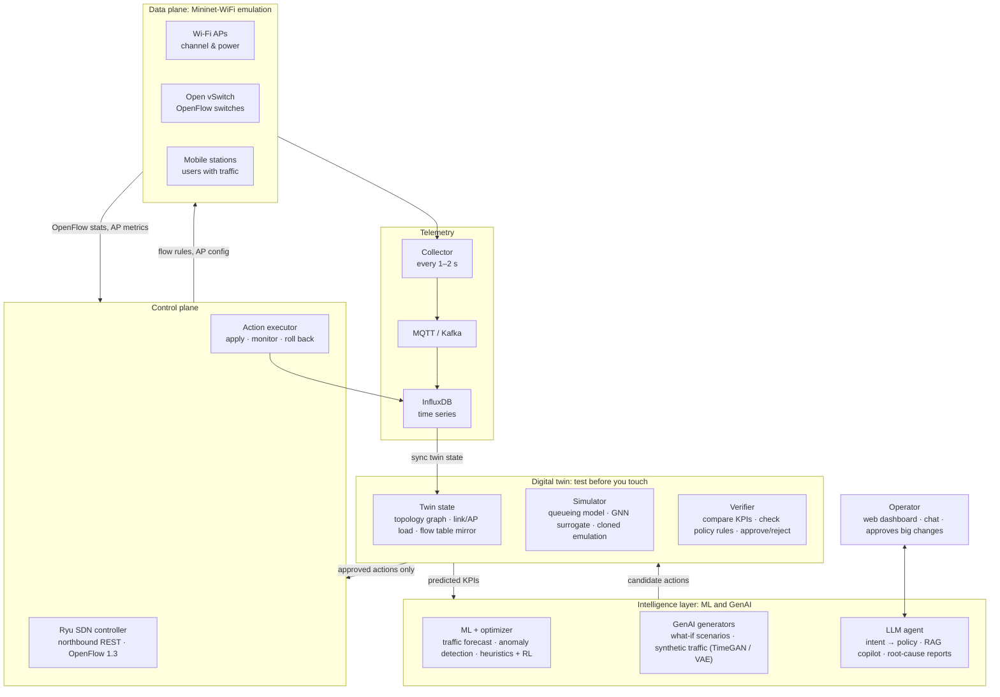
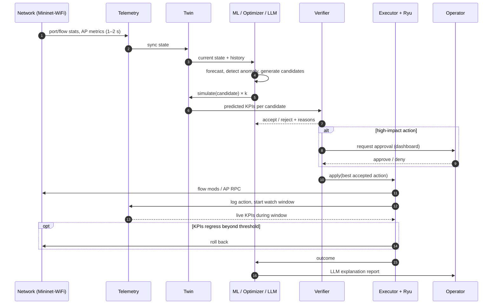
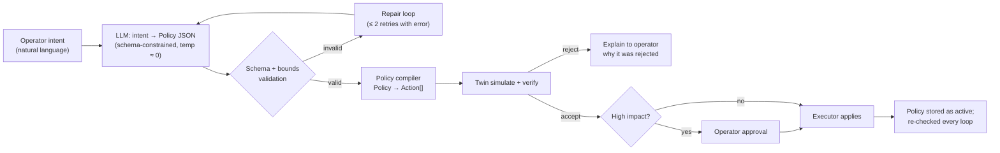

# GenAI-Driven Digital Twin for Intelligent SDN-Based Wireless Network Optimization

**Project report and detailed development plan**
Source: [project plan doc](https://claude.ai/artifact/QUKWaEwA6aLd2UFbJqY1PH) · Last updated: 2026-10-06

> **⚠ Superseded scope (2026-10-06):** the project now has **25 days (deadline Oct 31), 5 people, fully virtual, Ollama (cloud model + local fallback), and the deliverables are a report + live demonstration**. Execution follows [`PHASE_PLAN.md` v2.0](PHASE_PLAN.md). Out of scope: GNN, cloned-emulation twin, RL, LSTM/TFT, TimeGAN, RAG vector DB, scenario generator, config synthesis, React, hosted LLM APIs. These sections stay as the design reference and future-work list; where they conflict with PHASE_PLAN v2.0, the phase plan wins.

---

## Table of contents

1. [Executive summary](#1-executive-summary)
2. [Background concepts](#2-background-concepts)
3. [System architecture](#3-system-architecture)
4. [How it works end to end](#4-how-it-works-end-to-end)
5. [Where GenAI and LLMs fit](#5-where-genai-and-llms-fit)
6. [Other AI in the loop](#6-other-ai-in-the-loop)
7. [Data models and interfaces](#7-data-models-and-interfaces)
8. [Safety model](#8-safety-model)
9. [Tech stack](#9-tech-stack)
10. [Environment setup](#10-environment-setup)
11. [Development phases](#11-development-phases)
12. [Timeline](#12-timeline)
13. [Evaluation plan](#13-evaluation-plan)
14. [Engineering practices](#14-engineering-practices)
15. [Risks and fallbacks](#15-risks-and-fallbacks)
16. [Team, ownership and repository layout](#16-team-ownership-and-repository-layout)
17. [Open questions](#17-open-questions)
18. [Next steps this week](#18-next-steps-this-week)
19. [References and reading list](#19-references-and-reading-list)

---

## 1. Executive summary

We build a software copy of a wireless network, called a **digital twin**, that runs alongside an emulated (or real) **SDN** network. The SDN controller tests every change in the twin before applying it to the network. **GenAI and LLMs** sit on top. They turn plain-English goals into network policies, generate what-if scenarios and synthetic traffic, explain problems, and propose fixes. The twin checks every fix before it is deployed.

**The problem.** Wireless networks change all the time: users move, interference rises, traffic bursts. Traditional networks are tuned by hand and react late, and a bad config pushed straight to live equipment causes outages.

**The idea in one line.** Observe the live network, mirror it in a twin, let AI predict and propose, verify in the twin, then push only safe changes through the SDN controller. This is a closed loop:

> **observe → mirror → predict → decide → verify → act → explain and learn**

### What we will deliver

| # | Deliverable | Phase |
|---|---|---|
| D1 | Emulated wireless SDN testbed (Mininet-WiFi + Ryu controller) with a reproducible campus scenario | 0–1 |
| D2 | Telemetry pipeline and a labelled dataset (normal, congestion, AP failure, interference) | 2 |
| D3 | Digital twin that mirrors topology, link quality and traffic in near real time, plus a KPI simulator | 3 |
| D4 | ML models for traffic forecasting and anomaly detection | 4 |
| D5 | Optimization engine (heuristics plus reinforcement learning) for routing, channel and load balancing | 4 |
| D6 | LLM layer: intent-based control, RAG copilot, root-cause explanations, what-if generation | 5 |
| D7 | Web dashboard and one-command Docker Compose deployment | 6 |
| D8 | Evaluation report comparing four system variants, plus a final IEEE-format report and demo video | 6–7 |

### Headline claim to test

> The full system recovers from congestion faster than a plain SDN baseline, and the twin blocks harmful actions that an un-verified optimizer would have applied.

---

## 2. Background concepts

Four well-known ideas meet in this project. Each is established on its own; what's new here is wiring them into one closed loop.

| Concept | What it means | Role in our project |
|---|---|---|
| **SDN** | The control plane (decisions) moves out of switches into a central software controller. Switches only forward packets, using flow rules the controller installs over OpenFlow. | Gives us one programmable place to read network state and push changes. |
| **Wireless SDN** | SDN applied to Wi-Fi access points and stations. The controller also handles channels, transmit power, handovers and client-to-AP association. | Our target network: APs, mobile stations and a few switches. |
| **Digital twin** | A live virtual replica of a physical system. It is fed by real telemetry, and you can query it and run experiments on it without touching the real system. | A safe sandbox where every AI decision is tested before it reaches the network. |
| **GenAI / LLMs** | Models that generate text, code or data. LLMs understand natural language, reason, call tools and write configs. | Natural-language control, scenario and data generation, explanations, config synthesis. |

### SDN layers at a glance

- **Data plane:** switches and access points that forward traffic.
- **Control plane:** the controller (Ryu / ONOS / OpenDaylight). It talks to devices over the **southbound API** (OpenFlow, OVSDB, NETCONF).
- **Application plane:** apps that use the controller's **northbound REST API**. Our twin, optimizer and LLM agent live here.

### Why wireless SDN needs a twin

Wireless conditions are noisy and change by the second. Testing a new channel plan or routing policy on the live network risks dropped connections. The twin lets us ask *"what happens if…"* and get an answer in seconds, with no risk to the network.

---

## 3. System architecture

The system has four stacked layers plus a telemetry pipeline on the side. The digital twin sits **between the AI and the controller**, so anything an AI proposes must pass through the twin before it can reach the network.



Telemetry flows up the side into the twin. Decisions flow down the middle: the AI proposes, the twin verifies and the controller applies. The operator talks to the system in plain English through the LLM agent.

### Component responsibilities

| Component | Responsibility | Inputs | Outputs | Module |
|---|---|---|---|---|
| Topology + AP agent | Runs Mininet-WiFi, mobility and traffic; exposes AP/station control over RPC (channel, tx power, association) | scenario YAML | emulated network, AP metrics | `testbed/` |
| Ryu controller app | L2/L3 forwarding, stats polling, northbound REST, installs flow rules and QoS queues | OpenFlow events | REST stats, flow mods | `controller/` |
| Collector | Polls controller + AP agent every 1–2 s, normalizes, publishes | REST/RPC | MQTT messages | `telemetry/` |
| Storage | Time-series store for all metrics, actions and twin predictions | MQTT | InfluxDB measurements | `telemetry/` |
| Twin state | In-memory graph mirror of the network, synced from telemetry | InfluxDB / MQTT | `TwinState` snapshot | `twin/state/` |
| Simulator | Predicts KPIs for (state, action) | `TwinState`, `Action` | `KPIPrediction` | `twin/sim/` |
| Verifier | Accepts or rejects an action based on KPI deltas and policy constraints | predictions, policies | `Verdict` | `twin/verify/` |
| Forecaster / anomaly detector | Predicts per-AP load; flags abnormal telemetry | metric windows | forecasts, alerts | `ml/` |
| Optimizer | Generates candidate actions (heuristics, RL, LLM intent) | state, forecasts, alerts | `Action[]` | `ml/optimizer/` |
| LLM agent | Intent → policy, copilot chat, root-cause reports, scenario generation | operator text, tools | policies, answers, reports | `genai/` |
| Action executor | Applies approved actions, watches live KPIs, rolls back on regression | `Action`, `Verdict` | flow mods / AP RPC calls, audit log | `controller/executor/` |
| Backend API | Single API for dashboard and agent tools | all of the above | REST + WebSocket | `api/` |
| Dashboard | Topology map, KPI charts, twin-vs-live, action log, chat | backend API | UI | `dashboard/` |

> **Design note: AP control is not OpenFlow.** OpenFlow only controls forwarding. Changing an AP's channel or transmit power, or steering a station to another AP, happens through the Mininet-WiFi Python API inside the topology process. So the testbed needs a small **AP agent** (an RPC/REST server running inside the topology script), and the action executor calls it alongside Ryu.

---

## 4. How it works end to end

The system runs a continuous loop every few seconds (the target is 5 s). No change reaches the network unless the twin says it helps and breaks nothing.

| Step | What happens | Main tech |
|---|---|---|
| **1. Observe** | Ryu polls switch port stats and flow stats. The AP agent reports RSSI, SNR, channel utilization, connected clients and retries. Telemetry goes to MQTT and InfluxDB. | Ryu REST, `iw` station/survey dumps, MQTT, InfluxDB |
| **2. Mirror** | The twin updates its model: topology graph, per-link capacity and loss, per-AP load and per-flow demand. It stays in sync by replaying the latest telemetry. | NetworkX |
| **3. Predict** | ML models forecast traffic for the next 1–5 min and flag anomalies. A GNN can estimate per-path delay for configurations the network hasn't seen. | LSTM / TFT, autoencoder / Isolation Forest, GNN |
| **4. Decide** | The optimizer proposes actions: reroute flows, change an AP's channel or power, steer clients to a less-loaded AP, rate-limit a noisy flow. Proposals come from heuristics, an RL agent, or an LLM translating an operator's intent. | heuristics, PPO, LLM |
| **5. Verify** | Each candidate runs in the twin (fast simulation, or a cloned Mininet-WiFi run for high fidelity). Predicted KPIs (throughput, latency, loss, fairness) are compared with the current state, and policy constraints are checked. | twin simulator + verifier |
| **6. Act** | The best safe action is pushed through the controller's northbound API and AP agent. If live KPIs get worse within the observation window, the action rolls back automatically. | action executor |
| **7. Explain and learn** | The LLM writes a short, readable report of what happened and why. Outcomes feed back into retraining. | LLM, InfluxDB |

### Loop sequence



### Worked example: a lecture hall fills up

| Time | Event |
|---|---|
| 09:58 | The forecast model predicts AP-3 (lecture hall) will hit 92% channel utilization within 3 minutes. AP-4 next door is at 30%. |
| 09:58 | The optimizer generates three candidates: (a) steer 15 clients to AP-4, (b) move AP-3 from channel 6 to 11, (c) both. |
| 09:59 | The twin simulates each. Option (c) gives the lowest predicted latency with no loss of coverage. |
| 09:59 | The controller applies (c). Live latency stays under target. |
| 10:00 | The LLM posts: *"AP-3 was about to saturate because of the 10:00 lecture. Moved 15 clients to AP-4 and switched AP-3 to channel 11 to avoid overlap. Expected latency reduction: about a third."* |

*The numbers in this example are illustrative. Real gains come from the Phase 6 experiments.*

---

## 5. Where GenAI and LLMs fit

GenAI has six jobs in this system. One rule covers all of them:

> **The LLM proposes, the twin verifies, the controller executes. An LLM never writes directly to the live network.**

| # | Use case | What the AI does | Model / technique | Priority |
|---|---|---|---|---|
| 1 | **Intent-based networking** | The operator types *"Give video calls in Lab 2 priority and keep latency under 50 ms."* The LLM turns it into a structured JSON policy, which is then compiled into flow rules and QoS queues. | LLM with tool calling + JSON-schema output | Must have |
| 2 | **Network copilot (RAG chat)** | Answers questions like *"Why is AP-3 slow?"* by querying live telemetry, twin state and documents (OpenFlow spec, our runbooks). | LLM + retrieval over a vector DB (Chroma / FAISS) + tools | Must have |
| 3 | **Root-cause explanation** | Turns anomaly alerts and metric spikes into a plain-English diagnosis with a suggested fix. | LLM summarization over anomaly-detector output | Must have |
| 4 | **What-if scenario generation** | Generates realistic stress scenarios for the twin: "exam day", "AP failure in Block B", "microwave interference". | LLM writes scenario YAML validated against a schema | Should have |
| 5 | **Synthetic traffic and data** | Creates realistic traffic traces and user mobility to train ML models where real data is scarce. | TimeGAN / diffusion / VAE | Should have |
| 6 | **Config synthesis and validation** | Drafts controller app code or flow rules; a validator checks syntax, conflicts and loops before the twin test. | Code-capable LLM + rule checker | Nice to have |

### 5.1 Intent-based networking pipeline



The **LLM only produces the policy**. A deterministic Python **policy compiler** turns the policy into concrete actions such as queue assignments and flow matches. This keeps the LLM's output small, checkable and testable.

### 5.2 Network copilot (RAG)

- **Corpus:** OpenFlow 1.3 spec excerpts, Ryu and Mininet-WiFi docs, our runbooks (`docs/runbooks/*.md`), ADRs, and scenario descriptions.
- **Indexing:** chunk by heading (~500–800 tokens), embed, store in Chroma. Re-index on every docs change (a CI job).
- **Live data:** retrieved through **tools**, not embedded. Telemetry is always fetched fresh.
- **Answer format:** a short answer, the evidence (metrics and doc citations), and a suggested next action (which the operator can send to the twin with one click).

### 5.3 Root-cause explanation

Input: an anomaly alert (detector, score, affected entity, window) plus a ±5-minute metric window and recent actions from the audit log. Output (JSON): `{summary, likely_causes[ {cause, evidence, confidence} ], suggested_actions[], related_docs[]}`. Suggested actions go through the normal twin-verification path.

### 5.4 What-if scenario generator

The LLM writes a **scenario YAML** (see [§7.6](#76-scenario-yaml)). It does not write raw Python. A validator checks the YAML against the schema, then the testbed runs it in the twin, or in a cloned emulation for high fidelity. This makes generated scenarios safe, diffable and reproducible.

### 5.5 Synthetic traffic (GenAI, not LLM)

TimeGAN (or a simple VAE as a fallback) is trained on Phase 2 per-AP load series to generate extra realistic traces. Quality checks: compare distributions (KS test), autocorrelation, and **train-on-synthetic, test-on-real** forecaster accuracy.

### 5.6 How the LLM agent is built

**Agent loop:** the LLM gets a set of tools, then plans, calls tools, reads the results and answers.

| Tool | Purpose | Side effects |
|---|---|---|
| `get_topology()` | nodes, links, AP channels/power, station associations | none |
| `get_metrics(entity, metric, window)` | time series from InfluxDB | none |
| `get_alerts(since)` | recent anomaly alerts | none |
| `get_active_policies()` | current policies | none |
| `simulate_in_twin(action \| policy)` | predicted KPIs + verifier verdict | none (sandbox) |
| `apply_action(action_id)` | apply a **previously verified** action | **yes**; needs approval for high impact |
| `search_docs(query)` | RAG over docs and runbooks | none |
| `generate_scenario(description)` | returns validated scenario YAML | none |

- **Framework:** LangGraph, or the model provider's native tool-use API. Exposing the tools via an **MCP server** lets the same tools serve the agent, the dashboard and Claude Code during development.
- **Model choice:** a hosted frontier model (Claude / GPT / Gemini) for the best reasoning during development, plus a small local model via **Ollama** (Llama / Qwen / Mistral) as an offline option for demos and privacy. All calls go through a **provider-agnostic wrapper** (`genai/llm/client.py`) so the provider can be swapped by config.
- **Prompting:** the system prompt describes the network, the policy schema and the tool contracts. It includes few-shot intent → policy examples, and uses low temperature for config output.
- **Logging:** every LLM call is logged (prompt hash, model, tokens, latency, tool calls, result) to measure cost and support the evaluation.

### 5.7 Guardrails

1. Strict **JSON schema** for policies and actions (Pydantic).
2. An **allow-list of action types** (see [§7.3](#73-action-schema)); anything else is rejected.
3. **Numeric bounds** (for example, tx power 5–20 dBm, channels in {1, 6, 11} for 2.4 GHz).
4. **Every** action must pass a twin simulation; `apply_action` only accepts IDs of verified actions.
5. **Human approval** for high-impact changes (see [§8](#8-safety-model)).
6. A full **audit log** of who or what proposed each action, the twin verdict, the outcome and any rollback.
7. Prompt-injection hygiene: tool outputs and retrieved docs are treated as data. The agent cannot raise its own permissions.

---

## 6. Other AI in the loop

| Task | Model | Input → output | Metric | Fallback |
|---|---|---|---|---|
| Traffic forecasting | LSTM / GRU → Temporal Fusion Transformer | last 10 min per-AP load (1–2 s samples, resampled to 5 s) → next 1–5 min | RMSE, MAPE | moving average / Holt-Winters |
| Anomaly detection | Isolation Forest → autoencoder | windowed feature vectors per AP / link → anomaly score | precision, recall, F1 | static thresholds |
| Performance model | GNN (RouteNet-style), PyTorch Geometric | topology + routing + demand → per-path delay / jitter / loss | MAPE vs emulation | analytical queueing model |
| Control | PPO / DQN (Stable-Baselines3) | twin state → action | reward, KPI deltas | greedy heuristics |

### RL environment spec (Gymnasium, wraps the twin)

- **Observation:** per-AP vector `[channel_util, n_clients, avg_rssi, retries, load_forecast_t+1, t+3, t+5]` plus per-link utilization, normalized. Fixed size, with padding up to `MAX_APS`.
- **Action space (discrete):** `{no-op} ∪ {set_channel(ap, ch)} ∪ {steer(k clients, ap_from → ap_to)} ∪ {tx_power(ap, ±step)}`, masked to valid actions.
- **Reward:** `w1·Δthroughput − w2·Δlatency − w3·Δloss + w4·ΔJain_fairness − w5·handover_count − w6·[action ≠ no-op]`. The last term discourages unnecessary churn.
- **Episode:** one scenario replay of 5–10 simulated minutes. Training uses the fast simulator; final evaluation runs against the emulation.

---

## 7. Data models and interfaces

These are **starting contracts**. They should be agreed in week 2 and changed only through a short ADR (see [§14](#14-engineering-practices)).

### 7.1 Telemetry (MQTT topics → InfluxDB measurements)

| MQTT topic | InfluxDB measurement | Tags | Fields |
|---|---|---|---|
| `twin/telemetry/port` | `port_stats` | `dpid`, `port` | `rx_bytes`, `tx_bytes`, `rx_pkts`, `tx_pkts`, `rx_dropped`, `tx_dropped`, `rx_bps`, `tx_bps` |
| `twin/telemetry/flow` | `flow_stats` | `dpid`, `flow_id`, `app_class` | `bytes`, `pkts`, `duration_s`, `bps` |
| `twin/telemetry/ap` | `ap_stats` | `ap`, `channel` | `n_clients`, `channel_util`, `tx_power_dbm`, `retries`, `noise_dbm` |
| `twin/telemetry/station` | `sta_stats` | `sta`, `ap` | `rssi_dbm`, `snr_db`, `tx_bitrate_mbps`, `rx_bitrate_mbps`, `x`, `y` |
| `twin/telemetry/kpi` | `kpi` | `flow_id`, `app_class` | `throughput_mbps`, `latency_ms`, `jitter_ms`, `loss_pct` |
| `twin/events/action` | `actions` | `source`, `type`, `status` | `action_id`, `payload_json`, `verdict_json` |
| `twin/events/alert` | `alerts` | `detector`, `entity` | `score`, `details_json` |
| `twin/twin/prediction` | `twin_predictions` | `action_id`, `kpi` | `predicted`, `actual` (filled in later) |

Every message carries `ts` (UTC, ns) and `scenario_id`, `run_id`, so runs can be separated during evaluation.

### 7.2 Twin state

```python
@dataclass
class AP:
    id: str; channel: int; tx_power_dbm: float
    position: tuple[float, float]; clients: list[str]
    channel_util: float; retries: float

@dataclass
class Link:
    src: str; dst: str; capacity_mbps: float
    utilization: float; loss_pct: float; delay_ms: float

@dataclass
class Flow:
    id: str; src: str; dst: str; app_class: str   # video | web | bulk | voip
    demand_mbps: float; path: list[str]

@dataclass
class TwinState:
    ts: datetime
    graph: nx.Graph          # nodes: switches, APs, stations, hosts
    aps: dict[str, AP]
    links: dict[tuple[str, str], Link]
    flows: dict[str, Flow]
    policies: list["Policy"]
```

### 7.3 Action schema

```json
{
  "action_id": "act_20261006_095812_001",
  "type": "set_ap_channel",
  "target": "ap3",
  "params": { "channel": 11 },
  "source": "optimizer.heuristic | optimizer.rl | llm.intent | operator",
  "reason": "AP-3 forecast 92% util in 3 min; channel 6 overlaps AP-2",
  "created_at": "2026-10-06T09:58:12Z"
}
```

**Allow-listed action types and bounds**

| Type | Params | Bounds | Impact class |
|---|---|---|---|
| `reroute_flow` | `flow_id`, `path[]` | path must exist in topology, loop-free | low |
| `set_qos_queue` | `match`, `queue_id` | queue IDs pre-provisioned on OVS | low |
| `rate_limit_flow` | `flow_id`, `max_mbps` | ≥ 1 Mbps; not on `voip` class | medium |
| `steer_clients` | `from_ap`, `to_ap`, `stations[]` | ≤ 30% of `from_ap` clients per action; target RSSI ≥ −75 dBm | medium |
| `set_ap_tx_power` | `ap`, `dbm` | 5–20 dBm, step ≤ 3 dB | medium |
| `set_ap_channel` | `ap`, `channel` | 2.4 GHz: {1, 6, 11}; 5 GHz: allowed list | **high** |
| `ap_admin_state` | `ap`, `up/down` | never the last AP covering a zone | **high** |

### 7.4 Policy schema (LLM output for intents)

```json
{
  "policy_id": "pol_lab2_video",
  "intent_text": "Give video calls in Lab 2 priority and keep latency under 50 ms.",
  "scope":   { "zone": "lab2", "app_class": ["video"] },
  "objectives": [
    { "kpi": "latency_ms", "op": "<=", "value": 50 },
    { "kpi": "priority", "op": "=", "value": "high" }
  ],
  "constraints": [
    { "kpi": "loss_pct", "op": "<=", "value": 1, "scope": "all" }
  ],
  "valid": { "from": null, "until": null },
  "created_by": "llm.intent"
}
```

The policy compiler maps objectives to actions (for example `priority=high` → `set_qos_queue(queue_id=1)` for matching flows). Objectives stay active, and the verifier checks them every loop.

### 7.5 Verifier verdict

```json
{
  "action_id": "act_…",
  "accepted": true,
  "predicted": { "throughput_mbps": 412.3, "latency_ms": 31.0, "loss_pct": 0.4, "jain": 0.91 },
  "baseline":  { "throughput_mbps": 398.0, "latency_ms": 47.5, "loss_pct": 0.6, "jain": 0.84 },
  "violations": [],
  "impact": "high",
  "needs_approval": true,
  "sim_mode": "analytical | gnn | emulation",
  "sim_time_ms": 120
}
```

**Acceptance rule (initial):** reject if any hard policy constraint is violated, or if any KPI regresses by more than 5% while none improves by more than 5%. Otherwise rank by a weighted utility (the same weights as the RL reward).

### 7.6 Scenario YAML

```yaml
scenario_id: lecture_flash_crowd
duration_s: 600
seed: 42
topology: campus_v1            # testbed/topologies/campus_v1.py
mobility:
  model: scheduled_crowd
  groups:
    - { stations: 20, from: corridor, to: lecture_hall, start_s: 120, spread_s: 60 }
traffic:
  - { profile: video, stations: "lecture_hall:*", start_s: 180, rate_mbps: 3 }
  - { profile: web,   stations: "*", start_s: 0 }
events:
  - { at_s: 300, type: interference, ap: ap3, level: medium }
labels: [congestion]
```

### 7.7 Backend REST API (FastAPI, `api/`)

| Method | Path | Purpose |
|---|---|---|
| GET | `/topology` | current twin topology |
| GET | `/metrics?entity=&metric=&window=` | time series |
| GET | `/alerts?since=` | anomaly alerts |
| POST | `/twin/simulate` | body: `Action` or `Policy` → `Verdict` |
| POST | `/actions/{id}/apply` | apply a verified action (auth + approval rules) |
| POST | `/actions/{id}/approve` | operator approval |
| GET | `/actions?status=` | audit log |
| POST | `/intents` | natural language → policy → verdict (does not apply) |
| POST | `/chat` | copilot (SSE streaming) |
| POST | `/scenarios/generate` | description → validated YAML |
| WS | `/ws/live` | live KPIs, alerts and actions to the dashboard |

---

## 8. Safety model

| Impact class | Examples | Rule |
|---|---|---|
| Low | reroute a flow, change a QoS queue | auto-apply if twin accepts |
| Medium | steer clients, tx power, rate limit | auto-apply if twin accepts **and** confidence ≥ threshold; otherwise ask |
| High | change channel, AP down | **always** needs operator approval in the dashboard |

**Rollback:** after an action is applied, the executor watches live KPIs for `W` seconds (default 30 s). If any watched KPI is worse than the pre-action baseline by more than the threshold (default 10%), it reverts to the stored previous config and records `status=rolled_back`. Rollback events are counted in the evaluation as "bad actions that slipped past the twin".

**Rate limits:** at most 1 high-impact action per AP per 2 minutes, and at most N actions per loop. This prevents oscillation.

---

## 9. Tech stack

Everything here is free and runs on a laptop, apart from optional hosted LLM API calls. **Mininet-WiFi needs Linux**, so Mac users run it in an Ubuntu VM (UTM / Multipass) or a cloud VM.

| Layer | Recommended | Alternatives |
|---|---|---|
| Wireless emulation | Mininet-WiFi with **wmediumd** (Ubuntu 20.04 VM, see ADR-003) | ns-3 with LTE / 5G-LENA, OMNeT++ |
| SDN controller | Ryu (Python, easy to extend) | ONOS, OpenDaylight, Floodlight, OS-Ken |
| Switch | Open vSwitch (OpenFlow 1.3) | P4 / BMv2 for advanced work |
| Traffic generation | iperf3, D-ITG, Scapy | tcpreplay with public traces |
| Telemetry pipeline | Ryu REST stats + collector, MQTT (Mosquitto) | Kafka, Telegraf, sFlow-RT, gNMI |
| Time-series storage | InfluxDB 2.x | Prometheus, TimescaleDB |
| Twin model | Python: NetworkX + analytical simulator + GNN surrogate | cloned Mininet-WiFi instance for high fidelity |
| ML / DL | PyTorch, scikit-learn, PyTorch Geometric | TensorFlow |
| RL | Stable-Baselines3 + Gymnasium env wrapping the twin | RLlib |
| GenAI data | TimeGAN / Synthetic Data Vault | custom VAE |
| LLM | Claude / GPT / Gemini API; Ollama for local | Hugging Face models |
| Agent + RAG | LangGraph or native tool calling; MCP server; Chroma | LlamaIndex, FAISS |
| Backend API | FastAPI + Pydantic | Flask |
| Dashboard | React + vis-network (topology) + charts; Grafana for raw metrics | Streamlit (fastest to build) |
| DevOps | Docker Compose, GitHub, GitHub Actions | Kubernetes (overkill here) |

> **Known pitfall: Ryu and modern Python.** Ryu is no longer actively maintained and breaks with newer `eventlet` / Python versions. Pin it in its own environment (for example Python 3.9 with a pinned `eventlet`) or run it in a dedicated Docker container. If this becomes a problem, switch to **OS-Ken** (the maintained OpenStack fork with an almost identical API). Record the decision in an ADR.

---

## 10. Environment setup

### 10.1 Shared VM (the network side)

1. Create one **Ubuntu 20.04** VM (UTM on macOS; 4 vCPU, 4–6 GB RAM, 21+ GB root disk; see `docs/adr/003-vm-ubuntu-20-04.md`). Build it once and share the image so the whole team has an identical environment.
2. Install Mininet-WiFi from source with wmediumd support (follow the project's README; `sudo util/install.sh -Wlnfv` is the usual starting point).
3. Install Open vSwitch, iperf3, D-ITG.
4. Install Ryu (or OS-Ken) in a pinned environment.
5. Smoke test: start Ryu `simple_switch_13`, run a 2-AP / 4-station topology, then `pingall`.

### 10.2 Laptop / services side (Docker Compose)

Services: `mosquitto`, `influxdb`, `grafana`, `chroma`, `api` (FastAPI), `dashboard`, `ollama` (optional). The ML / twin / agent code runs as Python services or inside `api`.

### 10.3 Config and secrets

- `.env` (not committed) for LLM API keys and InfluxDB tokens; `.env.example` is committed.
- `config/*.yaml` for loop period, thresholds, bounds and model selection.

---

## 11. Development phases

Each phase ends with a **working demo**, so there is always something to show even if later phases slip.

**Critical path:** Phases 4 and 5 depend on a working twin, so protect **weeks 7–9**. If the twin slips, cut scope there first: drop the GNN and keep the analytical model.

Roles used below: **NET** = Network engineer · **TWIN** = Twin and data engineer · **ML** = ML engineer · **GENAI** = GenAI and full-stack.

---

### Phase 0: Research and setup (weeks 1–2)

**Goal:** a shared understanding, a working toolchain and agreed contracts.

| Task | Owner | Output |
|---|---|---|
| Read 6–10 key papers (digital twin networks, RouteNet/GNN, LLM intent-based networking, RL for Wi-Fi channel assignment) and write summaries | all (split) | `docs/literature/*.md` |
| Problem statement, objectives, KPIs | all | `docs/problem_statement.md` |
| Pick the scenario: campus Wi-Fi with 4–6 APs, 2–3 switches, 20–40 mobile stations | NET | `docs/scenario.md` |
| Build the shared Ubuntu VM: Mininet-WiFi + wmediumd, Ryu/OS-Ken, OVS | NET | VM image + `docs/setup.md` |
| Repo skeleton, Docker Compose with Mosquitto/InfluxDB/Grafana, CI (lint + tests) | GENAI | repo structure, `docker-compose.yml`, `.github/workflows/ci.yml` |
| Agree data contracts ([§7](#7-data-models-and-interfaces)) as Pydantic models | TWIN + GENAI | `common/schemas.py` |
| Pick LLM provider, get API keys, install Ollama as backup | GENAI | `.env.example`, ADR-001 |

**Exit criteria**
- `pingall` succeeds in a Mininet-WiFi topology controlled by Ryu.
- `docker compose up` starts the service stack.
- Literature review drafted; schemas merged.

**Demo:** a live Mininet-WiFi topology with Ryu forwarding traffic.

---

### Phase 1: Wireless SDN testbed (weeks 3–4)

**Goal:** a reproducible, scriptable campus network that we can observe and control.

| Task | Owner | Output |
|---|---|---|
| Campus topology script (APs, switches, hosts, zones) | NET | `testbed/topologies/campus_v1.py` |
| Mobility models: random waypoint, scheduled crowd movement | NET | `testbed/mobility/` |
| Scenario runner that reads scenario YAML ([§7.6](#76-scenario-yaml)) with a fixed seed | NET | `testbed/run_scenario.py` |
| AP agent: RPC/REST inside the topology process for `set_channel`, `set_tx_power`, `associate`, `get_ap_stats` | NET | `testbed/ap_agent.py` |
| Ryu app: L2/L3 forwarding, port and flow stats polling, REST endpoints, flow-mod and queue API | NET | `controller/apps/twin_controller.py` |
| Traffic profiles: video, web, bulk, voip (iperf3 / D-ITG) | NET + ML | `testbed/traffic/profiles.yaml` |
| KPI probes: throughput / latency / loss per flow | NET | `testbed/traffic/kpi_probe.py` |

**Exit criteria**
- The controller exposes live stats over REST, and the AP agent answers RPC calls.
- A scripted 10-minute scenario runs reproducibly: the same seed gives KPIs within ±5% across 3 runs.

**Demo:** run `lecture_flash_crowd`, watch the stats change, and change an AP's channel by hand through the AP agent.

---

### Phase 2: Telemetry pipeline and dataset (weeks 5–6)

**Goal:** all telemetry flowing into one store, plus a labelled dataset for ML and twin validation.

| Task | Owner | Output |
|---|---|---|
| Collector polls Ryu REST + AP agent every 1–2 s, normalizes to schema, publishes to MQTT | TWIN | `telemetry/collector/` |
| MQTT → InfluxDB writer | TWIN | `telemetry/writer/` |
| Grafana dashboards for raw KPIs | TWIN | `telemetry/grafana/*.json` |
| Scenario library: normal, flash crowd, AP failure, co-channel interference, mixed video + bulk | NET | `experiments/scenarios/*.yaml` |
| Batch runner: N scenarios × M seeds, unattended | NET + TWIN | `experiments/run_batch.py` |
| Dataset export (Parquet) with labels and run metadata | TWIN + ML | `data/` (gitignored) + `docs/dataset.md` |
| Exploratory data analysis notebook | ML | `experiments/notebooks/01_eda.ipynb` |

**Exit criteria**
- Several hours of labelled telemetry across all scenario types.
- Grafana shows live KPIs during a run.
- Collector lag under 2 s, with no gaps over 5 s in a 1-hour run.

**Demo:** a Grafana view of a flash-crowd run, plus a dataset summary.

---

### Phase 3: Digital twin core (weeks 7–9) *(critical path)*

**Goal:** a twin that mirrors the network and predicts the effect of actions accurately and quickly enough.

| Task | Owner | Output |
|---|---|---|
| `TwinState` builder and incremental sync from MQTT/InfluxDB | TWIN | `twin/state/` |
| Analytical simulator: per-link M/M/1-style queueing for delay; Wi-Fi airtime model for AP capacity (shared airtime across clients, co-channel overlap penalty) | TWIN | `twin/sim/analytical.py` |
| Action application in the twin (apply `Action` to a copy of state) | TWIN | `twin/sim/apply.py` |
| Verifier with acceptance rules and policy checks | TWIN + GENAI | `twin/verify/` |
| GNN surrogate (RouteNet-style), trained on Phase 2 data | ML + TWIN | `twin/sim/gnn/` |
| High-fidelity mode: clone the scenario into a second Mininet-WiFi instance and replay | NET | `twin/sim/emulation.py` |
| Validation harness: twin prediction vs actual measured outcome | TWIN | `twin/validation/` + notebook |
| `/twin/simulate` endpoint | GENAI | `api/routes/twin.py` |

**Exit criteria**
- The twin tracks live state with under 3 s lag.
- Throughput prediction error (MAPE) is **under 10–15%** on held-out runs for the analytical or GNN mode.
- A single simulation in fast mode takes under 1 s.

**Demo:** propose a channel change by hand; the twin predicts the KPIs; apply it; compare predicted and actual side by side.

---

### Phase 4: Intelligence and optimization (weeks 9–11)

**Goal:** a closed loop that runs unattended and beats the baseline.

| Task | Owner | Output |
|---|---|---|
| Per-AP traffic forecaster (baseline → LSTM → TFT if time allows) | ML | `ml/forecast/` |
| Anomaly detector (Isolation Forest → autoencoder) | ML | `ml/anomaly/` |
| Greedy heuristics: least-loaded AP steering, shortest-delay path, non-overlapping channels | ML | `ml/optimizer/heuristics.py` |
| Gymnasium env wrapping the twin ([§6](#rl-environment-spec-gymnasium-wraps-the-twin)) | ML + TWIN | `ml/rl/env.py` |
| PPO agent training and evaluation | ML | `ml/rl/train.py`, `models/` |
| Action executor: apply, watch window, rollback, audit log | NET + TWIN | `controller/executor/` |
| Loop orchestrator (observe → … → act on a timer) | TWIN | `twin/loop.py` |

**Exit criteria**
- The closed loop runs unattended through a congestion scenario.
- It beats the baseline on at least one KPI (for example, time to recover from congestion).
- Rollback is shown to work by deliberately injecting a bad action.

**Demo:** the flash-crowd scenario with the loop on vs off, KPIs side by side.

---

### Phase 5: GenAI and LLM layer (weeks 11–13)

**Goal:** natural-language control and explanation on top of the verified loop.

| Task | Owner | Output |
|---|---|---|
| Provider-agnostic LLM client (hosted + Ollama) with call logging | GENAI | `genai/llm/client.py` |
| Tool layer: MCP server and/or FastAPI tools ([§5.6](#56-how-the-llm-agent-is-built)) | GENAI | `genai/tools/` |
| Intent engine: NL → Policy JSON → compiler → twin verify | GENAI | `genai/intent/` |
| Intent test set: 50 hand-labelled intents → expected policies | GENAI + all | `genai/eval/intents.jsonl` |
| RAG index over docs and runbooks; copilot agent | GENAI | `genai/rag/`, `genai/agent/` |
| Root-cause explainer on anomaly alerts | GENAI + ML | `genai/rca/` |
| What-if scenario generator (NL → validated YAML) | GENAI + NET | `genai/scenarios/` |
| Synthetic traffic generator (TimeGAN / VAE) plus quality checks | ML | `ml/synthetic/` |

**Exit criteria**
- At least 20 test intents translated correctly (target: 50 in the evaluation).
- The copilot answers diagnostic questions using live data and cites evidence.
- **Every** LLM-originated action passes through the twin, as shown by the audit log.

**Demo:** type *"Give video calls in Lab 2 priority and keep latency under 50 ms"*, see the policy, the twin verdict, the approval and the effect. Then ask *"Why was AP-3 slow at 10:00?"*

---

### Phase 6: Dashboard, integration and evaluation (weeks 14–15)

**Goal:** one-command demo and final results.

| Task | Owner | Output |
|---|---|---|
| Dashboard: live topology with AP load heat colours, KPI charts, twin-vs-live view, action log with approve/deny, chat panel | GENAI | `dashboard/` |
| Full experiment campaign ([§13](#13-evaluation-plan)) | all | `experiments/results/` |
| Ablations: with/without twin, with/without LLM | ML + TWIN | results tables |
| Hardening: one-command startup, tests, error handling, logs | all | `make demo` / `docker compose up` |

**Exit criteria**
- The end-to-end demo runs from one command.
- Results tables and charts are ready, with confidence intervals.

**Demo:** the full system live.

---

### Phase 7: Report and presentation (week 16)

| Task | Owner | Output |
|---|---|---|
| Final report (IEEE format): architecture, method, results, limitations, future work | all | `docs/report/` |
| Diagrams and figures | GENAI + TWIN | `docs/figures/` |
| Recorded demo video (backup for the live demo) | GENAI | `docs/demo.mp4` (or a link) |
| Slides | all | `docs/slides/` |
| *Optional:* short workshop / conference paper | all | `docs/paper/` |

---

## 12. Timeline

| Phase | W1 | W2 | W3 | W4 | W5 | W6 | W7 | W8 | W9 | W10 | W11 | W12 | W13 | W14 | W15 | W16 |
|---|---|---|---|---|---|---|---|---|---|---|---|---|---|---|---|---|
| 0 Research & setup | ■ | ■ | | | | | | | | | | | | | | |
| 1 Wireless SDN testbed | | | ■ | ■ | | | | | | | | | | | | |
| 2 Telemetry & dataset | | | | | ■ | ■ | | | | | | | | | | |
| 3 Digital twin core ⚠ | | | | | | | ■ | ■ | ■ | | | | | | | |
| 4 Intelligence & optimization | | | | | | | | | ■ | ■ | ■ | | | | | |
| 5 GenAI & LLM layer | | | | | | | | | | | ■ | ■ | ■ | | | |
| 6 Dashboard & evaluation | | | | | | | | | | | | | | ■ | ■ | |
| 7 Report & presentation | | | | | | | | | | | | | | | | ■ |

⚠ = critical path. Overlapping weeks (9, 11) are hand-off weeks.

**Parallel work (so nobody is idle):**
- **GENAI** can start the LLM client, the tool stubs (against mock twin data) and the RAG index from **week 5**.
- **ML** can build the forecaster and anomaly detector on Phase 2 data from **week 6**, before the twin is ready.
- **Dashboard** skeleton (Streamlit first) from **week 8**, using the API as it grows.

### Milestones

| Week | Milestone |
|---|---|
| 2 | M0: toolchain works, contracts agreed |
| 4 | M1: reproducible scenario + controllable network |
| 6 | M2: labelled dataset available |
| 9 | M3: twin validated (MAPE target met) |
| 11 | M4: closed loop beats baseline |
| 13 | M5: LLM intents + copilot working through the twin |
| 15 | M6: results frozen, one-command demo |
| 16 | M7: report submitted, presentation |

---

## 13. Evaluation plan

We compare **four system variants** on the same scripted scenarios. Each run is repeated **at least 5 times** with different random seeds.

### Variants

| ID | Variant | What it isolates |
|---|---|---|
| V1 | **Baseline:** plain Ryu shortest-path forwarding, static channels, default AP association | reference |
| V2 | **SDN + heuristics:** optimizer acts directly, **no twin check** | value of the twin |
| V3 | **SDN + twin + ML/RL:** full closed loop **without LLM** | value of ML/RL with verification |
| V4 | **Full system:** twin + ML/RL + LLM intent and copilot | value of the LLM layer |

### Scenarios

Normal daytime load · lecture-hall flash crowd · AP failure · co-channel interference · mixed video + bulk traffic. Optionally, GenAI-generated stress scenarios as an extra test set.

### Metrics

| Category | Metric | How measured |
|---|---|---|
| Network performance | Throughput (Mbps), latency (ms), jitter, packet loss (%) | iperf3 / D-ITG logs, KPI probes |
| Wireless | Channel utilization, client fairness (Jain's index), handover count | AP stats |
| Twin fidelity | Prediction MAPE on throughput and delay; sync lag (s); sim time per action | twin prediction vs actual outcome |
| Optimization | Time to recover from congestion (s); bad actions blocked by the twin; rollbacks | action log |
| ML | Forecast RMSE / MAPE; anomaly precision / recall / F1 | held-out test set |
| LLM | Intent → policy accuracy on 50 test intents; invalid configs caught; diagnostic answer correctness; response time | hand-labelled test set |
| Cost | LLM tokens per action, controller CPU | logs |

### Protocol

1. Freeze code and configs (git tag `eval-v1`).
2. For each variant × scenario × seed (≥ 5): reset the network, run the scenario, export the metrics.
3. Report mean ± 95% confidence interval. Use a paired test (Wilcoxon) for V1 vs V4 on the headline metrics.
4. **Twin-blocking analysis:** log every action V2 would have taken, run each through the twin, and count how many the twin rejects and how many of those actually hurt KPIs when applied.
5. **LLM eval:** run the 50-intent set against the hosted and the local model. Report exact-match and semantic-match accuracy, plus the share of invalid outputs caught by validation.
6. Generate all tables and figures from `experiments/analysis/` scripts, never by hand.

---

## 14. Engineering practices

- **Branching:** `main` is protected. Use feature branches (`net/…`, `twin/…`, `ml/…`, `genai/…`) and PRs with at least one reviewer.
- **CI (GitHub Actions):** ruff + mypy (where practical) + pytest on every PR. The network emulation itself is not run in CI; it is mocked with recorded telemetry fixtures.
- **Tests:**
  - Unit: schemas, policy compiler, verifier rules, heuristics, simulator math.
  - Contract: the API and tool schemas match `common/schemas.py`.
  - Replay: recorded telemetry → twin → expected state.
  - LLM: intent test set as a regression suite (run nightly or on demand, since it costs tokens).
- **ADRs:** short markdown decision records in `docs/adr/` (for example ADR-001 LLM provider, ADR-002 Ryu vs OS-Ken, ADR-003 MQTT vs Kafka, ADR-004 analytical vs GNN twin).
- **Reproducibility:** every run records `scenario_id`, `seed`, git commit and config hash.
- **Weekly rhythm:** a 30-min sync, a demo every Friday, and a progress log in `docs/progress.md`.

---

## 15. Risks and fallbacks

| Risk | Likelihood | Impact | Fallback |
|---|---|---|---|
| Mininet-WiFi doesn't run on macOS | certain | high | Ubuntu VM via UTM / Multipass, or a cheap cloud VM; one shared VM image for the team |
| Ryu breaks on modern Python | medium | medium | pinned env / Docker; switch to OS-Ken |
| Emulated Wi-Fi metrics (channel util, interference) aren't realistic enough | medium | medium | use wmediumd interference model; derive airtime from station bitrates; document as a limitation |
| GNN twin model not accurate enough in time | medium | medium | analytical model + cloned-emulation twin; GNN as a stretch goal |
| RL agent doesn't converge | medium | low | ship the heuristic optimizer; present RL as an ablation |
| LLM produces wrong or unsafe configs | medium | high | schema validation, action allow-list, twin check, human approval; local fallback model |
| LLM API cost or no internet at demo | low | medium | Ollama local model; cached responses for the scripted demo; recorded video |
| Integration crunch at the end | high | high | integrate every phase in Docker Compose as we go, not in week 15 |
| Team member unavailable | medium | medium | each module has a secondary owner; contracts + tests let others pick it up |

---

## 16. Team, ownership and repository layout

### Team split (4 people)

| Role | Owns | Secondary on |
|---|---|---|
| **Network engineer (NET)** | Mininet-WiFi topology, mobility, AP agent, Ryu apps, traffic generation, action executor | telemetry collector |
| **Twin and data engineer (TWIN)** | Telemetry pipeline, InfluxDB, twin state, simulator, verifier, validation, loop orchestrator | GNN surrogate |
| **ML engineer (ML)** | Forecasting, anomaly detection, heuristics, RL env + agent, GNN surrogate, synthetic data | evaluation analysis |
| **GenAI and full-stack (GENAI)** | LLM client, agent, tools / MCP server, intent engine, RAG, FastAPI backend, dashboard, CI | verifier policy checks |

### Repository layout

```text
Digital-Twin-SDN/
├── testbed/            # Mininet-WiFi topologies, mobility, AP agent, traffic scripts, scenario runner
├── controller/         # Ryu apps: forwarding, stats, REST; executor/ (apply, watch, rollback)
├── telemetry/          # collector, MQTT → InfluxDB writer, Grafana dashboards
├── twin/               # state/, sim/ (analytical, gnn, emulation), verify/, validation/, loop.py
├── ml/                 # forecast/, anomaly/, optimizer/, rl/ (env + agents), synthetic/
├── genai/              # llm/ (client), tools/ (MCP), intent/, rag/, agent/, rca/, scenarios/, eval/
├── common/             # shared Pydantic schemas, config loading, logging
├── api/                # FastAPI backend (REST + WebSocket + SSE)
├── dashboard/          # React (or Streamlit) UI
├── experiments/        # scenarios/*.yaml, run_batch.py, analysis/, notebooks/, results/
├── config/             # loop, thresholds, bounds, model selection (YAML)
├── docs/               # this plan, setup, ADRs, runbooks, literature, report, figures
├── tests/              # unit, contract, replay tests + fixtures
├── docker-compose.yml
├── .env.example
└── README.md
```

---

## 17. Open questions

1. **Team size and timeline:** is it really 4 people and 16 weeks? This changes the phase plan.
2. ~~**Real hardware:** are Raspberry Pi / OpenWrt APs in scope, or emulation only?~~ **Decided: fully virtual, software only** (see `docs/decisions.md`).
3. **LLM provider:** which hosted model, and is there a budget for API calls?
4. **Report format:** IEEE format confirmed? Is a paper submission a goal?
5. **Controller:** stay with Ryu, or start directly on OS-Ken / ONOS?

---

## 18. Next steps this week

- [ ] Confirm team size, timeline, and whether real hardware (Raspberry Pi APs) is in scope
- [ ] Set up the shared Ubuntu VM with Mininet-WiFi + Ryu and run the first topology
- [ ] Split the paper list and draft the literature review
- [ ] Pick the LLM provider and get API keys; install Ollama as a backup
- [ ] Create the repo skeleton (folders above, README, `.gitignore`, `docker-compose.yml`, CI)
- [ ] Draft `common/schemas.py` from [§7](#7-data-models-and-interfaces) and review it as a team

---

## 19. References and reading list

Starting points for Phase 0. Verify the latest versions before citing.

- IRTF NMRG, *Digital Twin Network: Concepts and Reference Architecture* (Internet-Draft, `draft-irtf-nmrg-network-digital-twin-arch`).
- K. Rusek et al., *RouteNet: Leveraging Graph Neural Networks for Network Modeling and Optimization in SDN*, IEEE JSAC, 2020.
- R. R. Fontes et al., *Mininet-WiFi: Emulating Software-Defined Wireless Networks*, CNSM, 2015.
- J. Yoon, D. Jarrett, M. van der Schaar, *Time-series Generative Adversarial Networks (TimeGAN)*, NeurIPS, 2019.
- B. Lim et al., *Temporal Fusion Transformers for Interpretable Multi-horizon Time Series Forecasting*, International Journal of Forecasting, 2021.
- Survey papers on intent-based networking with LLMs (2023–2026). Search terms: "LLM intent-based networking", "LLM network configuration synthesis".
- Survey papers on RL for Wi-Fi channel assignment / load balancing. Search terms: "deep reinforcement learning Wi-Fi channel allocation".
- Ryu / OS-Ken documentation, the Mininet-WiFi documentation and examples, and the OpenFlow 1.3 specification.
