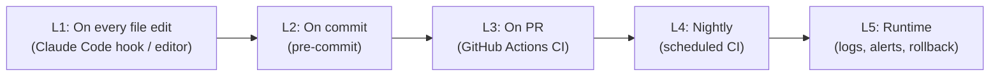

# Rule Book: Development, Quality and Safety

**Project:** GenAI-Driven Digital Twin for Intelligent SDN-Based Wireless Network Optimization
**Version:** v1.0 · 2026-10-06
**Applies to:** every team member and every AI coding assistant (Claude Code, Copilot, etc.)

> **Order of authority:** [`PHASE_PLAN.md`](PHASE_PLAN.md) (what and when) → **this rule book** (how) → [`PROJECT_PLAN.md`](PROJECT_PLAN.md) (design reference). If two documents conflict, the higher one wins. Raise the conflict through change control ([PHASE_PLAN §2](PHASE_PLAN.md#2-change-control)).

---

## Contents

1. [The 12 golden rules](#1-the-12-golden-rules)
2. [Staying on plan](#2-staying-on-plan)
3. [Never break what works](#3-never-break-what-works)
4. [Architecture and module boundaries](#4-architecture-and-module-boundaries)
5. [Coding standards (Python)](#5-coding-standards-python)
6. [Testing rules](#6-testing-rules)
7. [Automatic bug detection and fixing](#7-automatic-bug-detection-and-fixing)
8. [Bug-fix protocol](#8-bug-fix-protocol)
9. [Rules for AI coding assistants](#9-rules-for-ai-coding-assistants)
10. [Git and pull request rules](#10-git-and-pull-request-rules)
11. [Network and testbed safety](#11-network-and-testbed-safety)
12. [ML and experiment rules](#12-ml-and-experiment-rules)
13. [LLM and GenAI rules](#13-llm-and-genai-rules)
14. [Security and secrets](#14-security-and-secrets)
15. [Documentation rules](#15-documentation-rules)
16. [Universal Definition of Done](#16-universal-definition-of-done)
17. [Enforcement matrix](#17-enforcement-matrix)
18. [Recommended skills and tools](#18-recommended-skills-and-tools)
19. [Appendix: configuration files](#19-appendix-configuration-files)

---

## 1. The 12 golden rules

1. **Work only on the current task ID** from `PHASE_PLAN.md`. No task ID means no code.
2. **`main` is always green.** Every check passes on `main` at all times.
3. **No change without a test.** New behaviour gets a test, and a bug fix gets a regression test that failed before the fix.
4. **Never weaken a check to make it pass.** Don't delete or skip tests, loosen assertions, add `# type: ignore` or `# noqa` without a reason, or lower coverage.
5. **Contracts are frozen.** `common/schemas.py` and the API/tool shapes change only through an ADR.
6. **Small changes.** One task per PR, ideally under 400 changed lines.
7. **Run the checks before you push:** `make check` (lint + types + tests). Hooks run them automatically too.
8. **Nothing touches the network without the twin.** Every action needs an accepted `Verdict`, and the LLM never calls the controller or AP agent directly.
9. **No secrets in code, prompts, logs or git.** Use `.env` only.
10. **Reproducible or it didn't happen.** Every run records a seed, git commit, config hash and scenario ID.
11. **Find the root cause first, then fix it.** Don't fix by guessing (see [§8](#8-bug-fix-protocol)).
12. **Report honestly.** If something fails, say so with the output. If a step was skipped, say that.

---

## 2. Staying on plan

| Rule | Detail |
|---|---|
| **P-1** Task-scoped work | Each branch and PR names exactly one task ID, for example `P2.1`. |
| **P-2** No scope creep | Anything not in the current task goes to the **Parking lot** in `PHASE_PLAN.md`. Don't build it. |
| **P-3** Phase gates | Don't start tasks from a later phase until the current exit gate passes. The only exceptions are the early starts listed in `PHASE_PLAN.md`. |
| **P-4** Behind schedule | Use the phase **cut list**. Never quietly extend scope or deadlines. |
| **P-5** Deviations are logged | Any change to scope, schedule, tech or contracts goes into the **Deviation log** before the work starts. |
| **P-6** Done means Done | A task is closed only when its *Done when* list and [§16](#16-universal-definition-of-done) are both satisfied. |
| **P-7** Daily update | 15-minute stand-up every day; append to `docs/progress.md` (template in `PHASE_PLAN.md`) and update the status board (PHASE_PLAN v2.0). |

---

## 3. Never break what works

| Rule | Detail |
|---|---|
| **B-1** Full suite before merge | The whole test suite runs in CI on every PR, not just tests for the changed module. |
| **B-2** Contract tests guard interfaces | `tests/contract/` checks that the controller REST, AP agent, API, MQTT messages and LLM tools all match `common/schemas.py`. A contract test failure blocks the merge. |
| **B-3** Additive changes first | To change an interface: add the new version → migrate callers → remove the old one in a **separate** PR. Never rename and change behaviour in one step. |
| **B-4** No silent behaviour changes | If a function's output changes for the same input, the PR description says so and tests are updated **on purpose**, with a reason. |
| **B-5** Feature flags for risky paths | New optimizers, simulators and LLM features ship behind config flags (`config/*.yaml`) and stay off by default until their exit gate passes. |
| **B-6** Replay tests for the twin | Recorded telemetry → twin state → expected output. These catch regressions in sync, simulation and verification without needing the VM. |
| **B-7** Pin dependencies | Exact versions in a lock file (`uv.lock` / `requirements.lock`). Upgrades get their own PR with the full suite green. |
| **B-8** Don't touch other owners' modules casually | A change outside your module needs review from that module's owner (see `CODEOWNERS`). |
| **B-9** Frozen after `eval-v1` | After the Phase 6 freeze, only fixes needed to run the evaluation are allowed. |
| **B-10** Revert fast | If `main` breaks, revert the offending PR first, then investigate. Don't pile fixes on top of a broken `main`. |

---

## 4. Architecture and module boundaries

Dependencies point **one way**. A module may import only from the modules listed in its row.

| Module | May import from | Must NOT import from |
|---|---|---|
| `common/` | standard library, Pydantic | any project module |
| `testbed/` | `common` | everything else |
| `controller/` (Ryu app) | `common` (copied/vendored if Python versions differ) | `twin`, `ml`, `genai`, `api` |
| `controller/executor/` | `common`, `twin.verify` (types only) | `ml`, `genai` |
| `telemetry/` | `common` | `twin`, `ml`, `genai`, `api` |
| `twin/` | `common` | `ml`, `genai`, `api`, `controller` |
| `ml/` | `common`, `twin` (state + sim, for the RL env) | `genai`, `api`, `controller` |
| `genai/` | `common`; talks to the system **only through tools / API** | `controller`, `testbed`, `twin` internals |
| `api/` | `common`, `twin`, `ml`, `genai`, `controller/executor` | `testbed` |
| `dashboard/` | the HTTP/WS API only | any Python module |

**Process boundaries.** Cross-process communication uses REST, WebSocket or MQTT with schema-validated messages. Never use shared files or direct database writes from another module.

Enforced by `import-linter` contracts (see [§19](#19-appendix-configuration-files)) in pre-commit and CI.

---

## 5. Coding standards (Python)

### 5.1 Versions and tools

| Item | Standard |
|---|---|
| Python | **3.11** for all services. Ryu runs in its own pinned env (3.9) or uses OS-Ken (see ADR-002). |
| Package manager | `uv` (or `pip-tools`) with a lock file |
| Formatter | `ruff format` (line length 100) |
| Linter | `ruff check` with rules `E, F, W, I, B, UP, N, S, SIM, RUF, PL, PT, ASYNC` |
| Types | `mypy --strict` on `common/`, `twin/`, `controller/executor/`, `genai/intent/`; normal mode elsewhere |
| Tests | `pytest`, `pytest-cov`, `hypothesis` (for schemas and the simulator) |

### 5.2 Rules

| Rule | Detail |
|---|---|
| **C-1** Type hints everywhere | All public functions are fully typed. `Any` needs a comment explaining why. |
| **C-2** Validate at the boundary | Data from the network, MQTT, HTTP, files or the LLM is parsed into a Pydantic model on arrival. Inside the code, use the typed objects. |
| **C-3** No magic numbers | Thresholds, bounds, periods and weights live in `config/*.yaml` and are loaded through `common/config.py`. |
| **C-4** Logging, not print | Use `structlog` / `logging` with structured fields (`run_id`, `scenario_id`, `action_id`). `print` isn't allowed outside scripts and notebooks. |
| **C-5** Errors | No bare `except:`. No `except Exception: pass`. Catch specific exceptions, and add context when re-raising. Fail loudly in development. |
| **C-6** Timeouts and retries | Every network call has a timeout. Retries are bounded, with backoff (`tenacity`). |
| **C-7** No mutation of shared state | Twin simulation always works on a **copy** of `TwinState`. Functions don't mutate their arguments unless named `*_inplace`. |
| **C-8** Pure core, thin I/O shell | Simulator, verifier, heuristics and policy compiler are pure functions, which makes them easy to test. I/O sits at the edges. |
| **C-9** Async correctness | In FastAPI, use `async def` only with async I/O. Never block the event loop (wrap blocking calls with `run_in_threadpool`). |
| **C-10** Naming | `snake_case` functions and modules, `PascalCase` classes, `UPPER_CASE` constants. Units go in names: `delay_ms`, `rate_mbps`, `tx_power_dbm`. |
| **C-11** Small functions | Aim for 50 lines or fewer and 4 or fewer nesting levels. Ruff's `PLR` rules flag excess complexity. |
| **C-12** Docstrings | Every public function and class gets a one-line summary. Docstrings for non-obvious maths (simulator, reward) cite the formula. |
| **C-13** No dead code | No commented-out blocks. Delete them; git remembers. |
| **C-14** Notebooks are for exploration only | Code reused from a notebook moves into a module with tests. Notebooks are stripped of outputs before commit (`nbstripout`). |

### 5.3 Frontend (dashboard)

TypeScript strict mode, ESLint + Prettier, no `any`, API types generated from FastAPI's OpenAPI schema (`openapi-typescript`). If Streamlit is chosen instead, the Python rules above apply.

---

## 6. Testing rules

### 6.1 Test layers

| Layer | Location | Runs | Needs VM? | Purpose |
|---|---|---|---|---|
| Unit | `tests/unit/` | every edit (hook), pre-commit, CI | no | functions in isolation |
| Property | `tests/unit/` (`hypothesis`) | CI | no | schemas, bounds, simulator invariants |
| Contract | `tests/contract/` | CI | no | interfaces match `common/schemas.py` |
| Replay | `tests/replay/` | CI | no | recorded telemetry → twin → expected results |
| Integration | `tests/integration/` | CI (Docker services) | no | API + MQTT + InfluxDB together |
| Emulation | `tests/emulation/` (`@pytest.mark.vm`) | manually / nightly on the VM | **yes** | real Mininet-WiFi behaviour |
| LLM eval | `genai/eval/` | nightly / on demand | no | intent accuracy, RAG answers (costs tokens) |

### 6.2 Rules

| Rule | Detail |
|---|---|
| **T-1** Test-first for logic | Simulator, verifier, policy compiler, executor safety logic and heuristics are written **test-first** (red → green → refactor). |
| **T-2** Coverage floors | Overall at least 75%. **100% branch coverage** on safety code: `twin/verify/`, `controller/executor/`, `genai/intent/compiler.py`, action bounds in `common/schemas.py`. CI fails if coverage drops. |
| **T-3** No network in unit tests | Unit tests never open sockets. Use fixtures and fakes. `pytest-socket` enforces this. |
| **T-4** Deterministic | Fixed seeds, frozen time (`freezegun`), no sleeps. Flaky tests are fixed or quarantined within 24 h, never ignored. |
| **T-5** Safety invariants as tests | These must **always** be tested: (a) unverified actions are refused, (b) out-of-bounds actions are rejected, (c) high-impact actions require approval, (d) rollback restores the previous config, (e) LLM output never reaches the compiler without validation. |
| **T-6** Regression test per bug | Every fixed bug adds a test that fails on the old code (see [§8](#8-bug-fix-protocol)). |
| **T-7** Fixtures are versioned | Recorded telemetry fixtures live in `tests/fixtures/` with a README explaining how they were captured. |

---

## 7. Automatic bug detection and fixing

Bugs are caught in **five layers**, from fastest to slowest. Each layer **auto-fixes** what is safe to fix mechanically and **blocks** what needs a person.



| Layer | When | Auto-fixes | Detects and blocks |
|---|---|---|---|
| **L1 Edit-time** | after every file save or edit by an AI assistant | formatting, import order, simple lint fixes (`ruff check --fix`, `ruff format`) | type errors in the changed file (`mypy`), failing unit tests for the changed module |
| **L2 Pre-commit** | `git commit` | formatting, trailing whitespace, end-of-file, notebook outputs stripped | lint errors, type errors, secrets (`gitleaks`), large files, invalid YAML/JSON/TOML, import-boundary violations, fast unit tests |
| **L3 CI on PR** | every push to a PR | — | full lint + types, **full test suite**, coverage floors, contract + replay + integration tests, security scan (`bandit`), dependency audit (`pip-audit`), Docker build |
| **L4 Nightly** | scheduled, 02:00 | — | emulation tests on the VM runner (if available), LLM intent regression suite, twin MAPE check on the reference dataset, dependency update check |
| **L5 Runtime** | while running | **automatic rollback** of actions that make KPIs worse | anomaly alerts, schema validation failures logged, error-rate alerts in Grafana, LLM invalid-output counter |

### What "automatically fixes" means here

- **Auto-fixed by tools (safe and mechanical):** formatting, import sorting, unused imports, simple lint rules (pyupgrade, simplifications), whitespace, notebook outputs.
- **Detected automatically, fixed by a developer or AI assistant following [§8](#8-bug-fix-protocol):** logic errors, type errors, failing tests, contract violations, security findings. Tools find these instantly. A person or the assistant fixes the **root cause** and adds a regression test.
- **Never auto-fixed:** test expectations, schemas, safety bounds, thresholds. A change to any of these is a deliberate decision and goes through review.

### AI-assisted review (on demand)

| Command (Claude Code) | Use it for |
|---|---|
| `/code-review` | review a branch or PR against this rule book (standards) and `PHASE_PLAN.md` (spec) |
| `/security-review` | security review of pending changes |
| `/simplify` | clean-up pass on changed code (quality only; doesn't hunt bugs) |
| `systematic-debugging` skill | any failing test or unexpected behaviour, **before** proposing a fix |
| `tdd` skill | building safety-critical logic test-first |

---

## 8. Bug-fix protocol

Every bug, whether found by a tool, a test, a person or an AI assistant, follows these steps in order. **Don't skip to step 5.**

1. **Reproduce.** Get a minimal, reliable reproduction: a command, input or fixture.
2. **Write a failing test** that captures the bug (`tests/.../test_<bug>.py`). Confirm it fails.
3. **Find the root cause.** Read the error and stack trace, check recent changes (`git log -p`, `git bisect`), trace data across boundaries, and form **one** hypothesis at a time to test.
4. **Assess the blast radius.** Which modules, contracts and safety invariants are affected? If a contract or safety rule is involved, tag the module owner.
5. **Fix the root cause with the smallest change.** Don't change unrelated code, and don't change tests to fit the bug.
6. **Verify.** The new test passes, the **full** suite passes, and lint and types are clean.
7. **Record it.** The PR description states the cause, the fix and the test. For a severity 1–2 bug, add an entry to `docs/bugs.md`.

### Severity

| Sev | Meaning | Example | Response |
|---|---|---|---|
| 1 | Safety rule broken or `main` broken | an unverified action reached the network; CI red on `main` | stop feature work; revert or fix immediately |
| 2 | Wrong results | twin predictions off, metrics mislabelled | fix in the current week |
| 3 | Degraded but correct | slow simulation, noisy logs | schedule in the current phase |
| 4 | Cosmetic | dashboard alignment | parking lot |

**Three-strikes rule:** if three fix attempts fail, stop. Re-read the code, question the design assumption, and ask the module owner before trying again.

---

## 9. Rules for AI coding assistants

These rules apply to Claude Code and any other AI assistant working in this repo. They are also loaded automatically through `CLAUDE.md`.

| Rule | Detail |
|---|---|
| **AI-1** Read before acting | Before starting work, read `docs/PHASE_PLAN.md` (current phase and task), this rule book, and the files being changed. |
| **AI-2** Current task only | Work only on the task ID the user names. If the request is outside the plan, say so and suggest adding it to the parking lot or the deviation log. |
| **AI-3** No git commits or pushes | **The user commits and pushes themselves.** The assistant leaves changes in the working tree and reports what changed. |
| **AI-4** Check after every change | After editing code, run `make check` (or at least `ruff`, `mypy` and `pytest` on the affected module) and report the real result. |
| **AI-5** Never weaken checks | Never delete or skip tests, loosen assertions, add ignores, or change lint/type/coverage config to make a check pass. |
| **AI-6** Follow the bug-fix protocol | For any error, use the `systematic-debugging` approach: reproduce → failing test → root cause → minimal fix → full suite. |
| **AI-7** Respect boundaries | Obey [§4](#4-architecture-and-module-boundaries). Don't change `common/schemas.py`, safety bounds or thresholds without explicit user approval and an ADR. |
| **AI-8** No new dependencies silently | Adding a package requires saying why, pinning it, and updating the lock file. Prefer the standard library or existing dependencies. |
| **AI-9** Match the surrounding code | Same style, naming, comment density and patterns as the module being edited. |
| **AI-10** Honest reporting | State what was run and the outcome. If tests fail, show the output. Never claim something works without running it. |
| **AI-11** Destructive commands need approval | No `rm -rf`, `git reset --hard`, database drops, `sudo mn -c` on a shared VM, or force operations without asking. |
| **AI-12** No secrets | Never print, log or write the contents of `.env` or API keys. |
| **AI-13** Use the matching skill | Before starting a task, load the local skill whose trigger matches it ([§18](#18-recommended-skills-and-tools)), for example `tdd` for safety logic, `systematic-debugging` for errors, `fastapi` for the API, `dataviz` for charts. |

---

## 10. Git and pull request rules

*(For humans. The AI assistant doesn't commit; see AI-3.)*

| Rule | Detail |
|---|---|
| **G-1** Branches | `<role>/<task-id>-<short-name>`, for example `twin/P3.3-analytical-sim`. |
| **G-2** Commit messages | Conventional commits: `feat(twin): add airtime model [P3.3]`, `fix(executor): …`, `test:`, `docs:`, `chore:`. |
| **G-3** `main` protection | No direct pushes. A PR needs 1 approving review, green CI and an up-to-date branch. |
| **G-4** PR size | Under 400 changed lines where possible. Split larger work into stacked PRs. |
| **G-5** PR template | Every PR fills in the checklist in [§19.5](#195-pull-request-template). |
| **G-6** Review focus | Reviewers check task scope, tests, boundaries, safety invariants and readability, in that order. |
| **G-7** Merge style | Squash merge. The PR title becomes the commit message. |
| **G-8** Tags | `m0`…`m7` at each milestone, and `eval-v1` at the Phase 6 freeze. |

---

## 11. Network and testbed safety

| Rule | Detail |
|---|---|
| **N-1** Emulation only | Never connect the testbed to a real production network or a real Wi-Fi interface. |
| **N-2** Clean state | Run `sudo mn -c` before each scenario. The batch runner does this automatically between runs. |
| **N-3** Shared VM etiquette | Announce in the team channel before running long batches on the shared VM. Don't change VM packages without updating `docs/setup.md`. |
| **N-4** All changes through the executor | No manual `ovs-ofctl` changes or AP agent POST calls during an evaluation run. Manual changes are only for debugging, and they get logged. |
| **N-5** Bounds are enforced twice | Action bounds are checked in the schema **and** in the AP agent / executor (defence in depth). |
| **N-6** Rate limits and rollback are always on | They can't be disabled by config in demo or evaluation modes. |

---

## 12. ML and experiment rules

| Rule | Detail |
|---|---|
| **E-1** Seeds everywhere | Python, NumPy, PyTorch, scenario and RL seeds are all set from one config value and logged. |
| **E-2** Split by run | Train, validation and test are split **by run**, never by row. The test split is never used for tuning. |
| **E-3** Versioned data | Datasets live in `data/<version>/` with a manifest (scenarios, seeds, commit, date). Never edit a released version; create a new one. |
| **E-4** Versioned models | Models live in `models/<name>/<version>/` with their metrics, data version and commit. |
| **E-5** Baselines first | Every learned model is compared with a simple baseline (moving average, thresholds, heuristics). |
| **E-6** Results by script | Every reported number or figure is produced by `experiments/analysis/*.py` from raw results. |
| **E-7** No tuning after the freeze | After `eval-v1`, models and configs don't change. |

---

## 13. LLM and GenAI rules

| Rule | Detail |
|---|---|
| **L-1** Propose, verify, execute | The LLM proposes, the twin verifies, the executor applies. The LLM has no tool that writes to the network directly. |
| **L-2** Structured output | Config-producing calls use JSON schema / tool output at low temperature, and are validated by Pydantic. At most 2 repair retries, then the request fails safely. |
| **L-3** Prompts are code | Prompts live in `genai/prompts/*.md` (versioned, reviewed), not inline strings. Changing a prompt means re-running the intent eval. |
| **L-4** Provider-agnostic | All calls go through `genai/llm/client.py`. No provider SDK imports elsewhere. |
| **L-5** Log every call | Log model, prompt version, tokens, latency, tool calls, validation result and cost. Never log secrets. |
| **L-6** Untrusted inputs | Tool outputs, retrieved docs and operator text are treated as data. The agent can't change its own permissions or skip approval. |
| **L-7** Eval gate | A change to prompts, models or the intent pipeline must not lower intent accuracy on `genai/eval/intents.jsonl` by more than 2 points. |
| **L-8** Offline fallback | Every LLM feature has to work, possibly degraded, with the local Ollama model. |

---

## 14. Security and secrets

- `.env` is gitignored, and `.env.example` lists the variable names with no values.
- `gitleaks` runs in pre-commit and CI. If a secret leaks, **rotate the key immediately**; removing it from history isn't enough.
- `bandit` and `pip-audit` run in CI. High-severity findings block the merge.
- The API binds to `localhost` by default. Approval endpoints need an operator token.
- Never use `eval`/`exec` on LLM output, and never use `shell=True` with interpolated input.

---

## 15. Documentation rules

| Doc | Rule |
|---|---|
| `docs/adr/NNN-*.md` | One per decision about technology, schemas or architecture (context, decision, consequences). |
| `docs/setup.md` | Updated in the same PR as any setup change. |
| `docs/runbooks/*.md` | How to run, debug and recover each service. They are also part of the RAG corpus. |
| `docs/progress.md` | Weekly checkpoint (template in `PHASE_PLAN.md`). |
| `docs/bugs.md` | Severity 1–2 bugs: symptom, root cause, fix, regression test. |
| Module `README.md` | Every top-level module has a short README covering its purpose, how to run it, how to test it and its interfaces. |

---

## 16. Universal Definition of Done

A task is done only when **all** of these are true, in addition to its own *Done when* list in `PHASE_PLAN.md`:

- [ ] It matches the task ID scope. Nothing extra was built.
- [ ] Lint, format and types are clean (`make check`).
- [ ] New or changed behaviour has tests, and the full suite passes.
- [ ] Coverage floors are met, and safety code has 100% branch coverage.
- [ ] Contract tests pass, and no frozen interface changed without an ADR.
- [ ] No new warnings, ignores or skipped tests.
- [ ] Config values are in `config/`, and secrets are in `.env` only.
- [ ] The docs touched (README, setup, runbook, ADR) are updated.
- [ ] It runs inside the integrated stack (Docker Compose and/or the VM).
- [ ] The PR is reviewed and merged, and the status board is updated.

---

## 17. Enforcement matrix

| Rule area | Edit hook (L1) | Pre-commit (L2) | CI (L3) | Nightly (L4) | Review |
|---|---|---|---|---|---|
| Formatting / imports | ✅ auto-fix | ✅ auto-fix | ✅ check | | |
| Lint (ruff) | ✅ auto-fix | ✅ | ✅ | | |
| Types (mypy) | ✅ changed file | ✅ | ✅ full | | |
| Unit tests | ✅ module | ✅ fast subset | ✅ full | | |
| Coverage floors | | | ✅ | | |
| Contract / replay / integration tests | | | ✅ | | |
| Import boundaries (§4) | | ✅ | ✅ | | ✅ |
| Secrets | | ✅ gitleaks | ✅ gitleaks | | ✅ |
| Security / deps | | | ✅ bandit, pip-audit | ✅ update check | |
| Emulation tests | | | | ✅ (VM runner) | |
| LLM intent eval | | | | ✅ | ✅ on prompt change |
| Twin accuracy (MAPE) | | | | ✅ | |
| Task scope / plan adherence | | | ✅ PR title has task ID | | ✅ |
| Safety invariants | | | ✅ T-5 tests | | ✅ |

---

## 18. Recommended skills and tools

### Skills search (`npx skills find`, 2026-10-06)

No single skill automatically finds **and** fixes all bugs. The rule book gets there by combining tools, hooks and CI (§7) with the skills below.

| Skill | Installs | What it adds | Install |
|---|---|---|---|
| `mattpocock/skills@setup-pre-commit` | 420K | Sets up pre-commit hooks (layer L2) | `npx skills add mattpocock/skills@setup-pre-commit` |
| `mattpocock/skills@diagnosing-bugs` | 719K | Structured bug diagnosis (complements §8) | `npx skills add mattpocock/skills@diagnosing-bugs` |
| `mattpocock/skills@code-review` | 673K | Code review workflow | `npx skills add mattpocock/skills@code-review` |
| `mattpocock/skills@git-guardrails-claude-code` | 430K | Stops Claude Code running dangerous git commands (supports AI-3 / AI-11) | `npx skills add mattpocock/skills@git-guardrails-claude-code` |
| `mattpocock/skills@codebase-design` | 738K | Module boundary design (§4) | `npx skills add mattpocock/skills@codebase-design` |
| `anthropics/claude-plugins-official@claude-md-improver` | 11.6K | Keeps `CLAUDE.md` accurate as the project grows | `npx skills add anthropics/claude-plugins-official@claude-md-improver` |

Details for each are at `https://skills.sh/<owner>/<repo>/<skill>`. None are installed yet.

### Local skills (already installed in this Claude Code setup)

These are ready to use now. Call one by typing `/<skill-name>` in Claude Code, or ask Claude to use it. **Rule SK-1:** when a task matches a trigger in the table, the AI assistant loads that skill **before** starting the work.

#### Core workflow: use on every task

| Skill | Trigger: use it when… | Rule book link |
|---|---|---|
| `brainstorming` | designing a new component or feature **before** writing code (for example the simulator design in P3.3, the intent pipeline in P5.3) | §2 staying on plan |
| `tdd` | building logic test-first: simulator, verifier, policy compiler, executor safety paths, heuristics | T-1, T-5 |
| `systematic-debugging` | **any** failing test, error or unexpected behaviour, before proposing a fix | §8, AI-6 |
| `code-review` (`/code-review`) | before handing over a finished task, to review changes against this rule book (standards) and `PHASE_PLAN.md` (spec) | §16, G-6 |
| `simplify` (`/simplify`) | after a task works, for a clean-up pass on the changed code (reuse, simplification); doesn't hunt bugs | C-11, C-13 |
| `security-review` (`/security-review`) | before merging anything touching the API, approval endpoints, LLM tools, executor or secrets handling | §14 |
| `serena` | navigating or editing code by symbol (find references, rename safely across modules) as the codebase grows | B-3, B-8 |

#### Project setup and tooling

| Skill | Trigger: use it when… | Phase / task |
|---|---|---|
| `update-config` | installing the Claude Code edit-time hook (§19.4), permissions and env vars in `.claude/settings.json` | P0.3 |
| `fewer-permission-prompts` | Claude keeps asking permission for the same read-only commands (ruff, pytest, git status) | any |
| `init` | regenerating or extending `CLAUDE.md` once real code exists | after P1 |
| `find-skills` | looking for a new skill for a specialised need (for example Mininet, PyTorch Geometric) | any |
| `run` | launching the app or a service to see a change working, not just its tests | P1–P6 |
| `loop` / `schedule` | recurring checks (for example re-run tests every N minutes during a long debugging session) or a scheduled nightly job | P4–P6 |

#### Domain skills by phase

| Skill | Trigger: use it when… | Phase / task |
|---|---|---|
| `fastapi` | writing the backend API, routes, Pydantic models, dependencies, SSE streaming for `/chat`, WebSocket `/ws/live` | P3.6, P5.6, P6.1 |
| `claude-api` | building the LLM layer if the provider is Claude: client wrapper, tool use, structured output, prompt caching, model choice and pricing | P0.7, P5.1–P5.7 |
| `dataviz` | **any** chart: Grafana panel design, notebook plots, dashboard KPI charts, evaluation figures | P2.3, P3.4, P6.1, P6.6 |
| `frontend-design` | choosing the dashboard's visual direction before building it | P6.1 |
| `impeccable` | designing, critiquing or polishing the dashboard UI (layout, topology map, action log, chat panel, accessibility) | P6.1 |
| `web-design-guidelines` | auditing the finished dashboard against UI and accessibility guidelines | P6.1 exit |
| `claude-in-chrome` | driving the dashboard in a real browser: clicking through the approval flow, reading console errors, recording a GIF for the demo | P6.1, P7.3 |

#### Documents, report and presentation

| Skill | Trigger: use it when… | Phase / task |
|---|---|---|
| `anthropic-skills:docs` | shared, editable team documents (the original project plan lives in one) | any |
| `anthropic-skills:docx` | the final report has to be a Word / `.docx` file (for example an IEEE Word template) | P7.1 |
| `anthropic-skills:pdf` | reading research papers for the literature review; producing or merging the final PDF | P0.4, P7.1 |
| `anthropic-skills:pptx` | presentation slides as `.pptx` (not required: deliverables are report + live demo) | — |
| `anthropic-skills:xlsx` | results tables that need to go into a spreadsheet | P6.6 |

#### Skills by phase at a glance

| Phase | Skills to load |
|---|---|
| 0 Research & setup | `brainstorming`, `anthropic-skills:pdf` (papers), `update-config`, `claude-api` (provider choice), `find-skills` |
| 1 Testbed | `tdd`, `systematic-debugging`, `run` |
| 2 Telemetry & dataset | `tdd`, `dataviz` (Grafana and EDA), `systematic-debugging` |
| 3 Digital twin | `brainstorming`, `tdd`, `fastapi`, `dataviz` (validation plots) |
| 4 Intelligence | `tdd` (executor + heuristics), `systematic-debugging`, `dataviz` |
| 5 GenAI & LLM | `claude-api`, `fastapi`, `tdd` (compiler + validation), `security-review` |
| 6 Dashboard & eval | `frontend-design`, `impeccable`, `web-design-guidelines`, `claude-in-chrome`, `dataviz`, `code-review` |
| 7 Report | `anthropic-skills:docx` / `anthropic-skills:pdf`, `anthropic-skills:pptx`, `dataviz` |
| Every task | `systematic-debugging` (on errors), `code-review` + `simplify` (before hand-off) |

*Not relevant to this project (ignore):* fantasy-writing, YouTube scripting, voiceover, Tauri, Rust and macOS notarization skills.

---

## 19. Appendix: configuration files

These are **templates**, to be created in task **P0.3** (repo skeleton). Adjust them to match ADR decisions.

### 19.1 `pyproject.toml` (tool sections)

```toml
[tool.ruff]
line-length = 100
target-version = "py311"

[tool.ruff.lint]
select = ["E", "F", "W", "I", "B", "UP", "N", "S", "SIM", "RUF", "PL", "PT", "ASYNC"]
ignore = []

[tool.ruff.lint.per-file-ignores]
"tests/**" = ["S101", "PLR2004"]   # asserts and magic numbers are fine in tests

[tool.mypy]
python_version = "3.11"
warn_unused_ignores = true
warn_redundant_casts = true
disallow_untyped_defs = true

[[tool.mypy.overrides]]
module = ["common.*", "twin.*", "controller.executor.*", "genai.intent.*"]
strict = true

[tool.pytest.ini_options]
addopts = "-q --strict-markers --disable-socket --allow-unix-socket"
markers = [
  "vm: needs the Mininet-WiFi VM",
  "llm: calls an LLM (costs tokens)",
  "integration: needs docker compose services",
]

[tool.coverage.report]
fail_under = 75
show_missing = true

[tool.importlinter]
root_packages = ["common", "testbed", "controller", "telemetry", "twin", "ml", "genai", "api"]

[[tool.importlinter.contracts]]
name = "common is the base layer"
type = "forbidden"
source_modules = ["common"]
forbidden_modules = ["testbed", "controller", "telemetry", "twin", "ml", "genai", "api"]

[[tool.importlinter.contracts]]
name = "twin does not depend on ml/genai/api/controller"
type = "forbidden"
source_modules = ["twin"]
forbidden_modules = ["ml", "genai", "api", "controller"]

[[tool.importlinter.contracts]]
name = "genai talks to the system only through tools/api"
type = "forbidden"
source_modules = ["genai"]
forbidden_modules = ["controller", "testbed", "twin"]
```

### 19.2 `.pre-commit-config.yaml` (L2)

```yaml
repos:
  - repo: https://github.com/pre-commit/pre-commit-hooks
    rev: v5.0.0
    hooks:
      - id: trailing-whitespace
      - id: end-of-file-fixer
      - id: check-yaml
      - id: check-json
      - id: check-toml
      - id: check-added-large-files
        args: ["--maxkb=1024"]
      - id: check-merge-conflict
  - repo: https://github.com/astral-sh/ruff-pre-commit
    rev: v0.6.9
    hooks:
      - id: ruff
        args: ["--fix"]
      - id: ruff-format
  - repo: https://github.com/pre-commit/mirrors-mypy
    rev: v1.11.2
    hooks:
      - id: mypy
        additional_dependencies: ["pydantic>=2"]
  - repo: https://github.com/gitleaks/gitleaks
    rev: v8.21.0
    hooks:
      - id: gitleaks
  - repo: https://github.com/kynan/nbstripout
    rev: 0.7.1
    hooks:
      - id: nbstripout
  - repo: local
    hooks:
      - id: import-linter
        name: import boundaries
        entry: lint-imports
        language: system
        pass_filenames: false
      - id: fast-tests
        name: fast unit tests
        entry: pytest tests/unit -x -q -m "not vm and not llm and not integration"
        language: system
        pass_filenames: false
```

*Bump the `rev:` versions to the latest when this is set up (`pre-commit autoupdate`).*

### 19.3 GitHub Actions CI (L3): `.github/workflows/ci.yml`

```yaml
name: ci
on: [pull_request, push]
jobs:
  check:
    runs-on: ubuntu-latest
    services:
      mosquitto: { image: eclipse-mosquitto:2, ports: ["1883:1883"] }
      influxdb:  { image: influxdb:2, ports: ["8086:8086"] }
    steps:
      - uses: actions/checkout@v4
      - uses: astral-sh/setup-uv@v3
      - run: uv sync --frozen
      - run: uv run ruff check .
      - run: uv run ruff format --check .
      - run: uv run mypy .
      - run: uv run lint-imports
      - run: uv run pytest -m "not vm and not llm" --cov --cov-report=term-missing
      - run: uv run bandit -r common twin ml genai api controller -ll
      - run: uv run pip-audit
  pr-title:
    if: github.event_name == 'pull_request'
    runs-on: ubuntu-latest
    steps:
      - name: PR title must contain a task ID like [P3.3]
        run: echo "${{ github.event.pull_request.title }}" | grep -Eq '\[P[0-7]\.[0-9]+\]'
```

A separate `nightly.yml` (cron) runs the `llm` marker tests, the intent eval and the twin MAPE check.

### 19.4 Claude Code edit-time hook (L1)

**Implemented in P0.3** (2026-10-06): `.claude/settings.json` runs `scripts/claude_post_edit.sh` after every `Edit`/`Write`. For a `.py` file inside the repo, the script runs `ruff check --fix` and `ruff format` (auto-fix), then `ruff check` and `mypy` on that file. Any remaining errors exit with code 2, which sends the error output back to Claude so it fixes the cause right away. Other files are ignored. All tools run through `uv run`, so they use the project's pinned versions.

```json
{
  "hooks": {
    "PostToolUse": [
      {
        "matcher": "Edit|Write",
        "hooks": [
          { "type": "command", "command": "\"$CLAUDE_PROJECT_DIR\"/scripts/claude_post_edit.sh", "timeout": 120 }
        ]
      }
    ]
  }
}
```

Review or disable it with `/hooks` in Claude Code.

### 19.5 Pull request template: `.github/pull_request_template.md`

```markdown
## Task
[Px.y] <task title from PHASE_PLAN.md>

## What changed
-

## How it was tested
- [ ] Unit tests added/updated
- [ ] Full suite passes locally (`make check`)
- [ ] (if applicable) Ran on the VM / with docker compose

## Checklist (RULEBOOK §16)
- [ ] In task scope only; extras went to the parking lot
- [ ] No weakened checks (no skips, ignores, loosened asserts)
- [ ] No frozen contract changed (or ADR linked: )
- [ ] Safety invariants still tested (T-5)
- [ ] Config in `config/`, secrets in `.env` only
- [ ] Docs updated

## Bug fix only
- Root cause:
- Regression test:
```

### 19.6 `Makefile`

```makefile
.PHONY: check fmt test test-all
fmt:       ; ruff check --fix . && ruff format .
check:     ; ruff check . && ruff format --check . && mypy . && lint-imports && pytest -m "not vm and not llm and not integration" -q
test:      ; pytest -m "not vm and not llm" --cov
test-all:  ; pytest --cov
```
