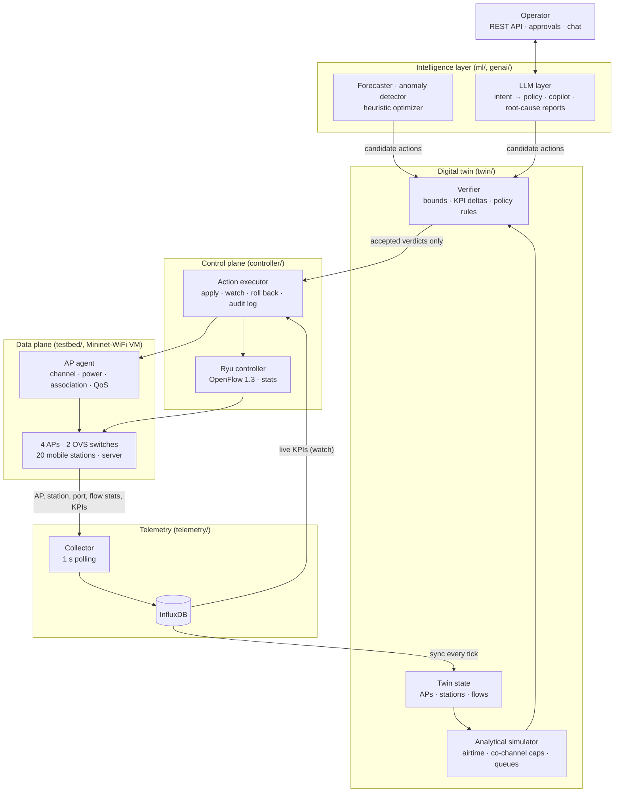
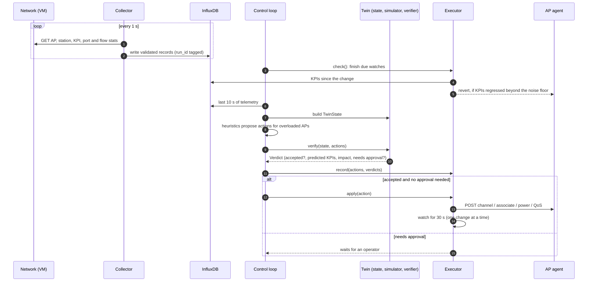
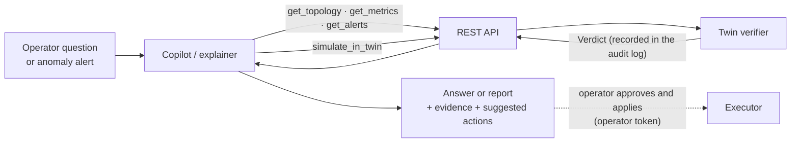

# 3. System Architecture

<!-- Drafted in P7.1b (2026-10-10). Describes the system as built; the original design is in docs/PROJECT_PLAN.md §3, and every change to it is in the PHASE_PLAN deviation log. -->

## 3.1 Overview and layers

The system is a closed control loop around an emulated campus Wi-Fi network. Its central design choice is the position of the digital twin. The twin sits **between the components that propose changes and the component that makes them**, so every proposed change, whether it comes from a heuristic optimizer or from a language model, is tested on the twin before it can reach the network. Figure 3.1 shows the four layers and the telemetry path beside them.

*Figure 3.1: Layers of the system. Decisions flow down the middle and telemetry flows up the side. The only arrow into the control plane comes from the verifier.*

The layers are:

- **Data plane.** A Mininet-WiFi emulation of a four-AP campus with mobile stations, Open vSwitch switches and a traffic server, running in a Linux VM (Chapter 5).
- **Control plane.** A Ryu OpenFlow controller for forwarding and port and flow statistics, plus an *action executor* that is the only component allowed to change the network.
- **Digital twin.** A mirror of the network's current state, an analytical model that predicts the KPIs a change would produce, and a verifier that accepts or rejects the change.
- **Intelligence layer.** Machine-learning components (a load forecaster, an anomaly detector and a heuristic optimizer) and an LLM layer (natural-language intents, an operator copilot and root-cause explanations).

The telemetry pipeline polls the data plane every second and stores everything in a time-series database. The twin and the executor read from that database, never from the network directly.

Two rules hold across the layers. First, **nothing reaches the network without an accepted twin verdict.** The executor refuses any action that has no accepted verdict on record (§3.3). The one exception is a written one: evaluation runs of the "V2" variant, which exists to measure what acting without the twin would do (ADR-005). Second, **the language model never touches the network.** It can read state and ask the twin about a change through a small set of validated tools. Applying a change is done by the executor alone, after the twin's check and, where required, an operator's approval.

The design departs from the original plan (PROJECT_PLAN §3) in three places, all recorded in the deviation log. The simulator is analytical only, with no learned surrogate and no cloned emulation (deviation #2). Telemetry goes straight from the collector to InfluxDB, without a message bus. The control loop lives in the API package, because module boundaries forbid the twin from importing the optimizer or the executor (deviation #13).

## 3.2 Components and responsibilities

Table 3.1 lists the components as built. Each is a Python package with a single responsibility. The imports between packages are restricted, and the restriction is checked automatically on every change (§5.4). For example, the twin may not import the controller, the ML code or the LLM layer, and the LLM layer may not import the controller, the testbed or the twin.

| Component | Responsibility | Package |
|---|---|---|
| Campus emulation | Topology, radio model, mobility and traffic for a scenario; emulated co-channel interference | `testbed/` |
| AP agent | REST server inside the emulation: AP channel and transmit power, station association, AP up/down, per-flow QoS queues and rate limits | `testbed/ap_agent.py` |
| Ryu controller app | L2 learning, port and flow statistics, northbound REST | `controller/apps/` |
| Collector | Polls the AP agent and Ryu every second, validates the records against the shared schemas, writes to InfluxDB | `telemetry/collector/` |
| Twin state and sync | Builds a `TwinState` (APs, stations, flows) from the last seconds of telemetry; marks silent APs as down | `twin/state/` |
| Simulator | Predicts per-flow throughput, latency and loss for a state, and for the state after a set of actions | `twin/sim/` |
| Verifier | Checks bounds and safety rules, compares predicted with current KPIs, checks the operator's policies, and returns a `Verdict` | `twin/verify/` |
| Forecaster, anomaly detector | Per-AP load forecast; Isolation Forest over whole-network windows | `ml/forecast/`, `ml/anomaly/` |
| Heuristic optimizer | Proposes client steering and channel changes for overloaded APs | `ml/optimizer/` |
| Action executor | Records verdicts, applies accepted actions through the AP agent, watches live KPIs for 30 s and rolls back a regression; keeps an audit log | `controller/executor/` |
| Control loop | Every 5 s: watch, observe, propose, verify, apply (one change at a time) | `api/loop.py` |
| Alert monitor | Scores the last 30 s of telemetry with the anomaly detector every 5 s | `api/alerts.py` |
| LLM client | The only path to a language model: cloud model with a local fallback, schema-constrained output, validation and repair, tool calling, a call log | `genai/llm/` |
| Tool layer | The five tools the LLM may call, with validated arguments | `genai/tools/` |
| Intent engine | Operator text → `Policy` → deterministic compiler → actions → twin verdicts | `genai/intent/` |
| Copilot | Tool-using agent that answers operator questions from live evidence | `genai/agent/` |
| Root-cause explainer | Turns an anomaly alert and the surrounding evidence into a diagnosis with suggested fixes | `genai/rca/` |
| REST API | One interface for operators, the dashboard and the LLM tools | `api/` |

*Table 3.1: Components as built.*

Two parts of the network are outside OpenFlow's reach, and this shapes the control plane. OpenFlow controls forwarding, but an AP's channel, its transmit power and which AP a station is associated with are radio settings. The executor therefore changes the network through two paths. Radio and QoS changes go to the AP agent, a small REST server that runs inside the emulation and drives Mininet-WiFi directly. Forwarding stays with Ryu. QoS is enforced at the AP as well (deviation #11): the AP radio is the bottleneck, not the 100 Mbit/s switch ports, so queues on the switches would change nothing.

## 3.3 Data flow: telemetry to twin to action

Figure 3.2 follows one tick of the control loop (every 5 s), from measurement to a kept or rolled-back change.

*Figure 3.2: One control-loop tick. The executor refuses to apply any action without an accepted verdict in its ledger.*

**Observe.** The collector polls the AP agent and the controller every second. It validates each record against the shared schemas and writes it to InfluxDB, tagged with the run it belongs to. Every 5 s the loop asks the twin for the network's state. The twin reads the last 10 s of that run's telemetry and keeps the newest row for each AP, station and flow. An AP with no statistics for 5 s counts as down.

**Propose and verify.** The heuristics look for overloaded APs and propose a client steer or a channel change. The verifier checks each proposal in three stages:

1. **Hard bounds:** the allowed parameter ranges, a transmit-power step of at most 3 dB, never disabling the last AP serving a zone, and a station's predicted signal at its new AP.
2. **Prediction:** the simulator predicts the KPIs of the flows the change affects, before and after the change.
3. **Comparison and policy:** the predicted KPIs are compared with the current ones and with the operator's standing policies.

The result is a `Verdict`: accepted or not, the predicted and baseline KPIs, the action's impact class and whether an operator must approve it.

**Apply, watch, roll back.** The executor keeps a ledger of every action and its verdict. It applies an action only if the action is in the ledger with an accepted verdict and, for actions that need approval, an operator's approval. Applying is also rate-limited. After applying, it watches the live KPIs for 30 s. If they are worse than before by more than a measured noise floor, it reverts the change. The loop changes one thing at a time. While a change is being watched, it proposes nothing new. A change that was rolled back is not proposed again for two minutes, so the loop cannot oscillate.

**The LLM paths** enter the same pipeline at the verifier, as Figure 3.3 shows. An operator intent is parsed into a `Policy` under a JSON schema. A deterministic compiler, not the model, turns the policy into actions, and those are verified like any other proposal. The copilot and the root-cause explainer read the network through the tool layer and can ask the twin about a change. What they propose is recorded with its verdict and returned to the operator as a suggestion. They hold no means of applying it.

*Figure 3.3: The LLM's path to the network. The dotted step is taken by a person, never by the model.*

## 3.4 Interfaces (REST API, schemas)

**Shared schemas.** All components exchange a small set of versioned Pydantic models in `common/schemas.py`, frozen at the end of Phase 0 (P0.6):

- *Telemetry records:* AP statistics, station statistics, port and flow statistics, and per-flow KPIs.
- *Actions:* a discriminated union of seven allow-listed action types, each with an impact class, listed in Table 3.2.
- *Verdicts.*
- *Policies:* the scope, objectives and hard constraints an operator intent compiles to.

Changing a schema needs an architecture decision record. Every boundary validates what it receives: the collector validates what the network reports, the API validates every request body, and the tool layer validates every argument the language model sends.

| Action | Parameters | Impact | Operator approval |
|---|---|---|---|
| `reroute_flow` | flow, path | low | no |
| `set_qos_queue` | match (zone, flow or app class), queue | low | no |
| `rate_limit_flow` | flow, maximum Mbit/s (≥ 1) | medium | until validated |
| `steer_clients` | from AP, to AP, stations | medium | no (validated, §6) |
| `set_ap_tx_power` | AP, dBm (0–20) | medium | until validated |
| `set_ap_channel` | AP, channel 1, 6 or 11 | high | always |
| `ap_admin_state` | AP, up or down | high | always |

*Table 3.2: The action allow-list. A medium-impact type is applied without approval only once the twin's predictions for it have been validated against the testbed (P3.5). So far, only client steering has been validated.*

**REST API.** The API (`api/app.py`, FastAPI) is the single interface for operators, the dashboard and the LLM tools. It binds to localhost only.

| Route | Purpose |
|---|---|
| `GET /topology` | The twin's current state |
| `GET /metrics?entity=&metric=&window=` | One telemetry series of an AP, station or flow |
| `GET /alerts?since=` | Live anomaly alerts |
| `POST /twin/simulate` | Verify a set of actions together; the verdicts are recorded |
| `POST /intents` | Operator text → policy, actions and verdicts (nothing is applied) |
| `POST /chat` | The copilot's answer, its evidence and its suggested actions |
| `POST /actions/{id}/approve` | Operator approval (operator token required) |
| `POST /actions/{id}/apply` | Apply the verified set the action belongs to (operator token required) |
| `GET /actions?status=` | The executor's audit log |

*Table 3.3: REST API.*

Approving and applying require an operator token, which is compared in constant time. With no token configured, both routes are refused. Every LLM-backed feature has a configuration flag, along with the simulator and the alert monitor. A switched-off feature answers *503 Service Unavailable*, so a component that has not yet passed its evaluation cannot be reached by accident.

**The LLM's tools.** The language model sees five tools: `get_topology`, `get_metrics`, `get_alerts`, `simulate_in_twin` and `apply_action`. In the live system `apply_action` only *proposes*. It records nothing new and returns "awaiting operator". The copilot is not given it at all. The tools reach the system only through the REST API above, so the model's view of the network, and its access to it, are exactly an operator's minus the token.
