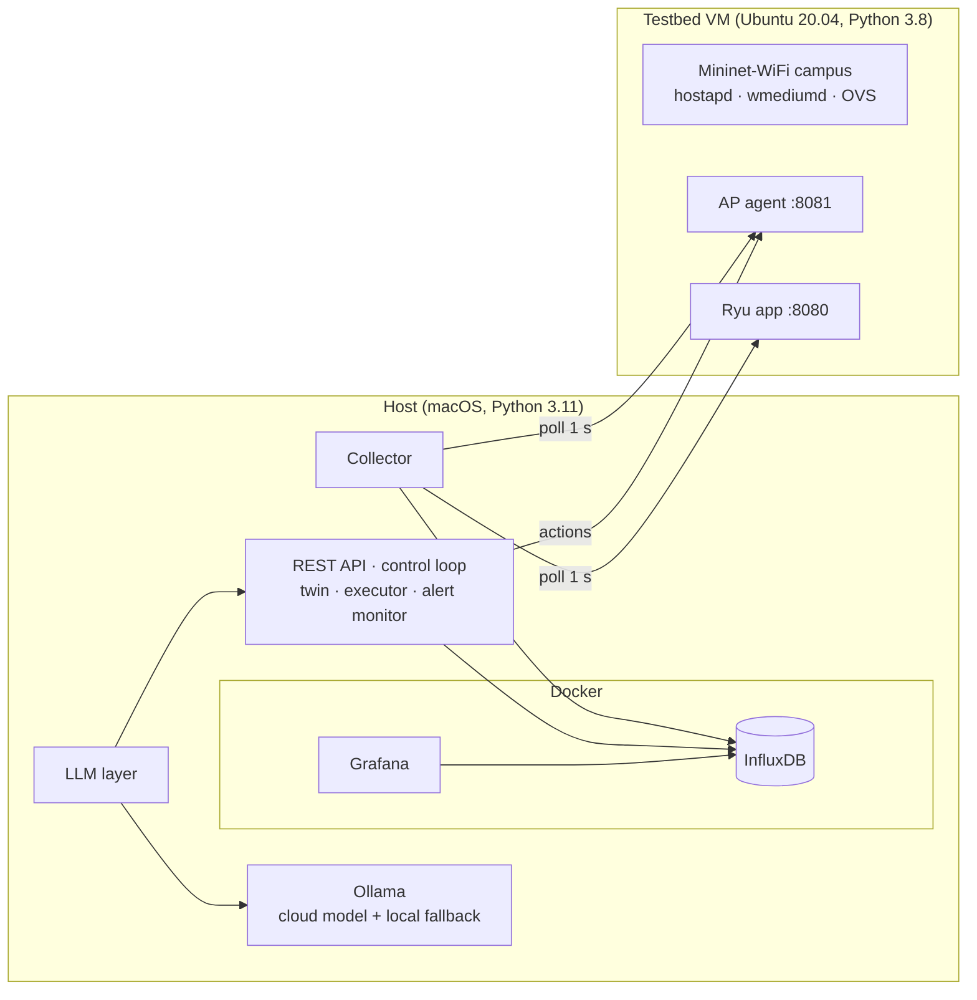

# 5. Implementation and Testbed

<!-- Drafted in P7.1b (2026-10-10). Testbed facts: docs/setup.md, docs/scenario.md, docs/dataset.md. Dataset sizes: data/v1/manifest.json. -->

The system is written in Python. The controller-side and twin code run on a macOS host. The emulated network runs in an Ubuntu VM on the same machine. Figure 5.1 shows what runs where.

*Figure 5.1: Deployment. The VM is reached over a host-only network; the API listens on localhost only.*

## 5.1 Emulated campus (Mininet-WiFi, Ryu)

**Environment.** The testbed VM runs Ubuntu 20.04 (aarch64, 4 vCPU) under UTM on Apple Silicon. On it run Mininet-WiFi 2.7 with hostapd, wmediumd in interference mode and Open vSwitch 2.13, and the Ryu 4.34 controller (OpenFlow 1.3). The exact versions and install steps are in `docs/setup.md`. Code that runs on the VM is kept compatible with its Python 3.8. Code on the host uses Python 3.11. The two talk only over HTTP.

**Campus.** The emulated campus is 80 m × 70 m with four zones: lecture hall, lab, corridor and library. Each zone has one 2.4 GHz AP, on channels 1, 6, 11 and 1. The two channel-1 APs are on opposite corners, 50 m apart. The four APs hang off two OVS switches joined by a 100 Mbit/s link. A server on the first switch is the endpoint of all traffic. Twenty stations start at seeded random positions in their zones and associate with their zone's AP. The layout and all radio numbers are in `config/campus_v1.yaml`, which the testbed, the twin and the LLM prompts all read.

**Controller.** The Ryu application (`controller/apps/twin_controller.py`) does L2 learning, polls port and flow statistics, and offers a northbound REST interface: statistics, the learned topology, and installing or removing flows. Its parsing and validation live in a pure-Python module that is unit-tested on the host.

**AP agent.** OpenFlow cannot change radio settings, so a small REST server runs inside the topology process. It reads AP, station and per-flow KPI statistics, and it is the actuator for radio and QoS changes:

- set an AP's channel (a hostapd channel switch, which clients follow);
- set its transmit power;
- associate a station with a given AP;
- take an AP down or bring it up;
- assign a flow to a QoS queue, or rate-limit it.

Bad requests are refused with 4xx errors. Only the action executor calls the agent's write endpoints.

**QoS at the bottleneck.** Calibration showed that the AP radio, not the wired network, limits throughput (§5.2). Queues on the switch ports would therefore have no effect, so priorities and rate limits are enforced on each AP's downlink with Linux `tc` (deviation #11). The AP agent owns one HTB tree per AP. Its root is the AP's current capacity. Under it are three strict-priority queues (priority, best effort, background) and a child class for each rate-limited flow. The tree is rebuilt whenever the AP's capacity or any flow's QoS changes. Filters match the station's address, so a station steered to another AP keeps its treatment. A live check on the testbed confirmed 10 of 10 expected behaviours, including priority under load and a rate cap holding to its limit (`make qos-vm`).

## 5.2 Scenarios and interference emulation

**Radio model.** Two calibration findings (P1.6) shaped the testbed:

- **Each emulated AP carries about 4.6 Mbit/s downlink, whatever bitrate the radio reports.** A single bulk flow reaches 4.56 Mbit/s, and three flows together share 4.62 Mbit/s.
- **APs on the same channel do not slow each other down** in mac80211_hwsim with wmediumd.

The emulator therefore has no co-channel interference, although that is one of the faults the system must handle. The scenario runner emulates it explicitly (deviation #7). While two or more APs that are up share a channel, each one's downlink is capped at

$$ \text{cap} = \frac{C}{1 + \sum_j w(d_j)}, \qquad w(d) = \begin{cases} 1 & d \le 30\ \text{m} \\ (60 - d)/30 & 30 < d < 60 \\ 0 & d \ge 60\ \text{m} \end{cases} $$

where $C = 4.6$ Mbit/s and the sum runs over same-channel APs at distance $d_j$. An interference controller re-reads the live channels every second and updates the caps, so a channel change really removes the interference. With the default channels, the two channel-1 APs, 50 m apart, are each capped at 3.45 Mbit/s. The twin's simulator uses the same model and the same parameters.

**Traffic.** All traffic is downlink from the server to the stations:

- **video:** iperf3 UDP at a fixed rate;
- **bulk:** iperf3 TCP;
- **web:** curl fetching 50 KB pages, with about 5 s of think time.

A per-flow probe reports throughput, latency, jitter and loss every second. Traffic is sized to the measured capacity, so that a scenario stresses one AP while its neighbours have room to help.

**Scenarios.** A scenario is a YAML file (`experiments/scenarios/`): a seed, the traffic, the mobility and timed events. A scenario runner on the VM plays it unattended for 10 minutes. Table 5.1 lists the four scenarios.

| Scenario | What happens | Stress |
|---|---|---|
| `normal` | Everyone browses; three video calls and one capped bulk transfer | none (busiest AP ~1.9 of 4.6 Mbit/s) |
| `lecture_flash_crowd` | 10 stations walk into the lecture hall (t = 120–160 s); from t = 210 s all 13 stream the lecture | ap1 at ~180% of its 3.45 Mbit/s cap |
| `ap_failure` | Video calls in the lab and the lecture hall; ap2 (lab) goes down at t = 240 s and its stations rejoin the nearest AP still up | ap1 at ~99% of its cap |
| `cochannel_interference` | Video calls in the corridor and the lecture hall; ap3 is forced onto channel 1 at t = 180 s | ap3 capped at 1.72 Mbit/s for ~3.4 Mbit/s of demand |

*Table 5.1: Scenarios. Events such as the AP failure are the environment changing. They do not pass through the twin; only the executor acts on the system's behalf.*

A run is reproducible from its seed. Three runs of the flash crowd with the same seed reached the same mean flow throughput to within 1%. Each run writes a manifest with its seed, the code commit and a hash of its configuration, plus an event log with the scenario time of every event, cap change and re-association. Under these caps congestion shows mainly as **packet loss**, not delay. The queue under each cap is `fq_codel`, which drops early instead of letting a long queue build.

## 5.3 Telemetry pipeline and dataset

**Collector.** The collector (`telemetry/collector/`) runs on the host. Every second it polls, in parallel:

- the AP agent's AP, station and KPI endpoints;
- the controller's port and flow statistics.

Each response is validated against the shared schemas on arrival, and invalid records are logged and dropped. The valid ones are tagged with the scenario and run ID and written to InfluxDB in a single batch. A message bus is not used: writing directly is enough for one testbed, and it removes a moving part. The collector tracks its own health. *Lag* is the time from a record's timestamp to its write, and must stay under 2 s. A *gap* is the time between successful polls of one source, and must stay under 5 s. A run that breaks either limit is marked failed.

**Batch runner.** `experiments/run_batch.py` plays a batch of scenarios × seeds unattended. For each run it does the following:

1. Synchronises the VM's clock with the host.
2. Starts the scenario on the VM over SSH and waits for the AP agent to answer.
3. Runs the collector for the scenario's duration.
4. Copies the run's manifest and logs back.

A run during which the host slept is detected (the VM's clock falls behind) and marked failed, and re-running the batch repeats only failed runs. The same runner can play a schedule of actions, the control loop or the GenAI evaluation alongside a run. These are used for twin validation and for the evaluation (Chapter 6). In those evaluation runs the features being measured are switched on whatever their configuration flags say (the simulator, the copilot, the alert monitor), because they are measured before their flags may be turned on. Nothing applies their proposals: the GenAI runs hold no operator token (ADR-005 and its addenda).

**Dataset.** The training dataset (`data/v1`) is the first batch: 4 scenarios × 3 seeds, 10 minutes each, so **12 runs and 2 hours of telemetry**. It is split by run, not by time window: seed 42 is training, 43 validation and 44 test. No run is split across sets, and every scenario appears in every split. The export writes one Parquet file per measurement:

- AP statistics: 27,674 rows;
- station statistics: 143,760 rows;
- per-flow KPIs: 77,299 rows;
- port and flow statistics: 107,582 and 1,129,109 rows.

It also writes a manifest with the commits and per-split row counts. Every row carries its run, seed, split, scenario time, a `phase` label (normal before the run's disruption, stress from it on) and the disruption's name. Datasets are versioned and never edited in place.

## 5.4 Software engineering: tests, checks, reproducibility

**Structure and boundaries.** The repository has one top-level package per component (Table 3.1), plus `common/` for the shared schemas and helpers, and `experiments/` for batches and analysis. Which package may import which is declared as ten import-linter contracts and checked on every change. For example:

- the twin may not import the ML code, the LLM layer, the API or the controller;
- the LLM layer may not import the controller, the testbed or the twin;
- the Ryu application may not import the twin.

Each package validates its own configuration file and refuses unknown keys.

**Checks.** `make check` runs four checks, and all four must pass before a change is kept:

- the `ruff` linter and formatter;
- `mypy` in strict mode;
- the import contracts;
- the test suite with branch coverage.

The unit tests run with network sockets disabled, so a test can never reach the VM, the database or a language model by accident. At the time of writing the suite has **1,225 tests at 97.4% branch coverage**, against a required 75%. Code that runs only on the VM is covered by scripted live checks instead: the controller, AP agent, mobility, traffic, QoS and reproducibility checks under `testbed/checks/`. A separate `make security` target runs `bandit` and `pip-audit`. Pre-commit hooks include `gitleaks`, so secrets cannot be committed. Secrets live only in an untracked `.env` file.

**Safety in the code, not only in the design.** Every safety rule of §3.3 is enforced in code and covered by tests:

- the executor refuses an action without an accepted verdict;
- it refuses one that needs approval but has none;
- it never applies an action twice;
- it rolls back on regression;
- approving and applying need the operator token;
- every LLM output and every tool argument is validated before use.

Invalid LLM output stops before the intent compiler, and the compiler itself has 100% branch coverage. Every new LLM-backed feature ships behind a flag that is off until its evaluation passes.

**Reproducibility and traceability.** Experiments are seeded. Scenario runs record their seed, commit and configuration hash, and evaluation scripts write their results to versioned files, which Chapter 6 reports from. Each design change is recorded in two places:

- a deviation log in the phase plan: what changed, why, and its impact;
- an architecture decision record, for the changes that touch a contract or a safety rule. There are six, among them the evaluation exception of ADR-005.

The project was built by one developer working with an AI coding assistant, Claude Code. A written rulebook governs that work: test-first development for safety-critical logic, no weakened checks, and no changes to schemas or safety thresholds without a recorded decision.
